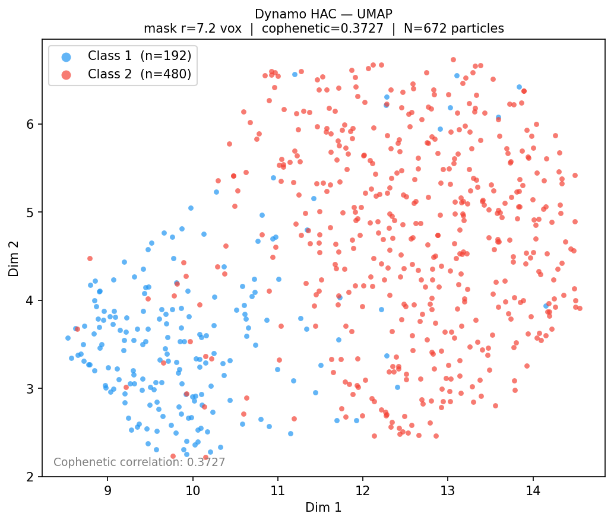
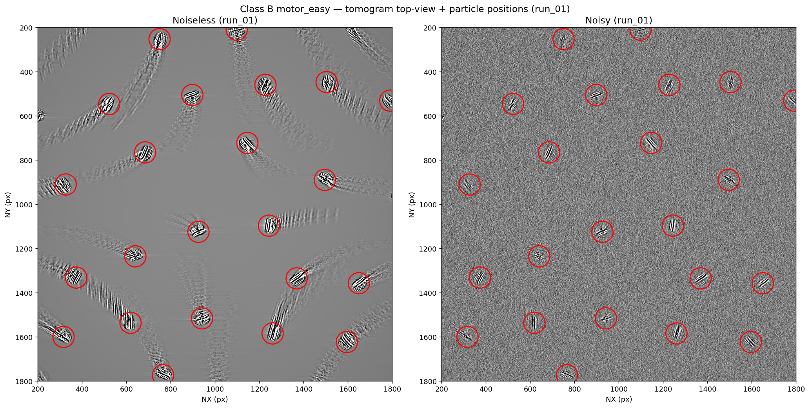
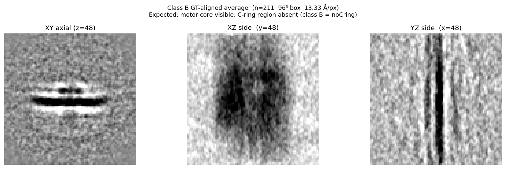
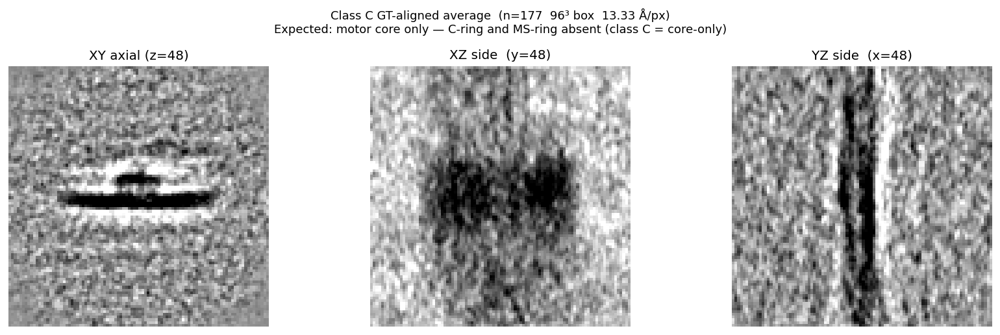
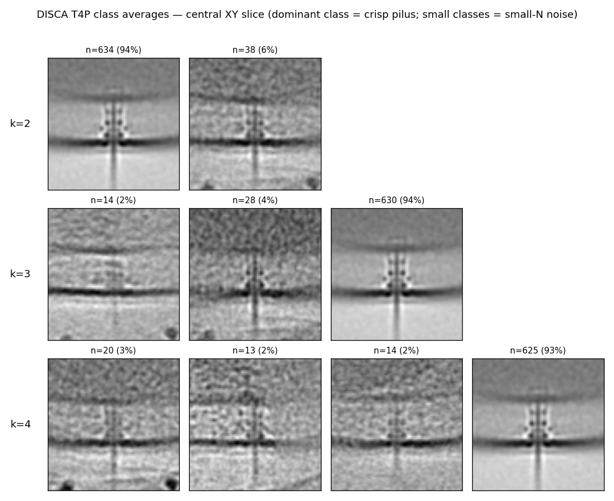
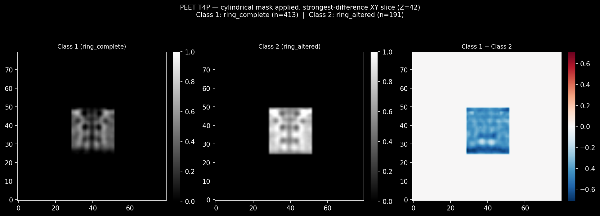

# STA Benchmark — CryoET Subtomogram Classification

**The first systematic benchmark of 3D-input subtomogram classification packages on realistic in-situ CryoET data of membrane-embedded complexes.**

> Real sparse data (500–1000 particles) · In-situ membrane-embedded targets · Expert ground truth · Synthetic data with known class labels · 10+ packages evaluated

---

## Table of Contents

1. [Background](#background)
2. [Project Goal](#project-goal)
3. [What Makes This Benchmark Unique](#what-makes-this-benchmark-unique)
4. [Datasets](#datasets)
5. [Packages Evaluated](#packages-evaluated)
6. [Evaluation Framework](#evaluation-framework)
7. [Preliminary Findings](#preliminary-findings)
8. [Open Questions](#open-questions)
9. [Team](#team)

---

## Background

### Single Particle Analysis (SPA)

SPA is the dominant cryo-EM method for determining macromolecular structure. The target complex is biochemically purified and flash-frozen in a thin ice layer. The electron microscope collects thousands of 2D projection images of the same complex at random orientations; these are aligned and averaged to reconstruct the 3D density map. SPA works exceptionally well—but only for complexes that can be isolated from the cell.

### CryoET and Subtomogram Averaging (STA)

Many of the most scientifically important complexes—the **Flagellar Motor**, **Type IV Pilus (T4P)**, nuclear pore complex, and others—are membrane-embedded. Trying to isolate them breaks apart the cell membrane, destroying the very structure you want to image. **Cryogenic Electron Tomography (CryoET)** solves this by imaging the entire intact cell. The sample is tilted through a series of angles (typically ±60°), and the 2D images at each tilt are computationally reconstructed into a 3D volume called a **tomogram** (`.mrc` format).

From the tomogram, the target complex is located, extracted as a small 3D subvolume (a **subtomogram**), and aligned so all copies face the same direction. Averaging hundreds of aligned subtomograms produces a 3D electron density map at higher signal-to-noise ratio. This entire pipeline is called **Subtomogram Averaging (STA)**.

Because the complex is imaged *in situ* inside an intact cell, the population of complexes spans all their natural conformational states—assembly intermediates, active/inactive forms, ligand-bound states. **Classification** is the step that sorts these subtomograms into structurally distinct classes before averaging, and it is the focus of this benchmark.

---

## Project Goal

Many packages using different classification algorithms have been developed for STA. However, **no systematic benchmarking has been done** across these packages on the same dataset with standardized preprocessing. This project creates such a benchmark:

- **Real dataset:** 672 prealigned T4P subtomograms from *Vibrio* cells with expert-validated ground truth
- **Synthetic dataset:** 634 subtomograms of flagellar motor assembly intermediates with exact per-particle ground-truth class labels
- **Packages:** 10+ packages run on both datasets with identical preprocessing
- **Evaluation:** Four-pillar scoring framework (external validity, downstream resolution, stability, cross-package consensus)

---

## What Makes This Benchmark Unique

| Challenge | Existing benchmarks | This benchmark |
|---|---|---|
| **Target complexity** | Mostly soluble complexes (80S ribosome, etc.) that don't need CryoET | Membrane-embedded complexes (T4P, flagellar motor) — the canonical CryoET targets |
| **Particle count** | 10,000–100,000 particles | 500–1,000 particles — realistic for large membrane complexes |
| **Input dimensionality** | Mix of 2D and 3D workflows | 3D-only classifiers, isolating the subtomogram classification step |
| **Ground truth** | Computationally generated from known structures | Expert visual inspection (T4P) + simulation ground truth (synthetic) |
| **Scope** | Individual package evaluations | Systematic head-to-head comparison with standardized I/O |

Sparse particle counts (~600–1000) fundamentally change classification: resolution and class separation depend heavily on N, noise dominates individual particles, and instability is the primary failure mode. Existing benchmarks at 10,000+ particles simply do not test this regime.

---

## Datasets

### Real Data — Type IV Pilus (T4P), *Vibrio* sp.

**672 hand-picked, prealigned 80³ subtomograms** at 13.33 Å/px, extracted from *Vibrio* cryo-tomograms.

**Ground truth (expert, Stefano):** Two structurally distinct pili-phase classes exist in this dataset. Dynamo HAC classification recovers them cleanly (447 vs. 225 particles) and was confirmed correct by visual inspection by the domain expert. This two-class split is the reference standard against which all other packages are measured.

<p align="center">
  
</p>

<p align="center"><em>Dynamo HAC classification of T4P (reference result). Two structurally distinct pili phases are cleanly separated. Class 1 resolves to 62.7 Å (FSC=0.5); Class 2 to 96.9 Å due to smaller class size. Central XY slices shown.</em></p>

<p align="center">
  
</p>

<p align="center"><em>UMAP of Dynamo's cross-correlation embedding (672 particles). The two classes occupy largely distinct regions of embedding space, confirming genuine structural separation.</em></p>

---

### Synthetic Data — Flagellar Motor Assembly Intermediates (`motor_easy`)

**634 subtomograms** simulated with ETSimulations at 13.33 Å/px, 80³ box, SNR matched to the real T4P data. Three ground-truth classes model progressive flagellar motor assembly:

| Class | Description | N particles | Notes |
|---|---|---|---|
| **A** — `ring_complete` | Full motor: C-ring + MS-ring present | 246 | Most assembled state |
| **B** — `noCring` | Motor core + MS-ring, C-ring absent | 211 | |
| **C** — `core_only` | Motor core only, both rings absent | 177 | Least assembled state |

Class differences are ~30 Å — large enough to be detectable but realistic for assembly intermediates. A smaller-difference dataset is planned as a harder benchmark track.

<p align="center">
  
</p>

<p align="center"><em>Simulated motor_easy tomogram (Class B shown): noiseless reconstruction (left) alongside the realistic noisy reconstruction (right) with particle positions marked. Noise and missing wedge artifacts from the ±60° tilt-series simulation are clearly visible.</em></p>

<table align="center">
  <tr>
    <td align="center">
      
      <br><em>Class B GT-aligned average (n=211)<br>Motor core + MS-ring; C-ring absent</em>
    </td>
    <td align="center">
      
      <br><em>Class C GT-aligned average (n=177)<br>Motor core only; both rings absent</em>
    </td>
  </tr>
</table>

**GT separability (validated):** Template-matching on GT-aligned subtomos gives ARI = 0.289 (~68–73% per-class accuracy on individual noisy particles), confirming the classes are structurally distinct but not trivially separable. Class average CCs: A–B = 0.72, A–C = 0.66, B–C = 0.83.

Per-particle ground-truth labels: `synthetic_sta/motor_easy/production/labels.csv`.

---

## Packages Evaluated

We evaluate only packages that perform classification on **3D subvolumes** as input. This focuses the benchmark on the classification step while acknowledging that many modern packages have shifted to 2D workflows for efficiency (a companion 2D benchmark is a natural extension).

<details>
<summary><strong>Full package status table (click to expand)</strong></summary>

Legend: ✅ done · 🟡 in progress · ⬜ not started · ❌ skipped

| Package | Status | Env | k=2 | k=3 | k=4 | T4P result | Notes |
|---|---|---|---|---|---|---|---|
| **RELION 3.1–4.0** | ✅ | `relion-5.0` | ✅ | ✅ | ✅ | Missed two phases (CC 0.97–0.997, no discrete split) | Classic `relion_refine` 3D-classify path retained in RELION 5 |
| **Dynamo** | ✅ | MATLAB | ✅ | — | — | **Reference result** — cleanly recovers both phases (HAC 447:225, expert-confirmed) | `dynamo/` workspace |
| **PEET** | 🟡 | IMOD | 🟡 | — | — | k=2 best result 412:260 (PCs 1:3); cannot fully reproduce paper's 5:1 (uniform-wedge pre-aligned stack) | Need Stefano's MOTL for exact GT labels |
| **PyTom** | ✅ | `pytom_env` | ✅ | ✅ | ⬜ | k=2 and k=3 class averages look identical — classification not separating structure | `PyTom/figures/` |
| **DISCA** | ✅ | `disca` | ✅ | ✅ | ✅ | One dominant ~94% class + small outliers — missed both phases | Template-free deep clustering; `disca/results/` |
| **TomoFlow** | ✅ | `tomoflow` | ✅ | ✅ | ✅ | Unimodal landscape — missed both phases (k=3 two large-class CC 0.956) | ContinuousFlex-based; `tomoflow/results/` |
| **I3 / ProTomo** | ✅ | native | ✅ | — | — | CC = 0.921; did not recover the two phases | `protomo/` |
| **EMAN2** | ✅ | `eman2` | ✅ | ⬜ | ⬜ | k=2: splits particles but not into the two known pili phases | `~/src/eman2_project/`; k=3/4 pending |
| **OPUS-TOMO** | ✅ | `opuset` | ✅ | ✅ | ✅ | Generates multiple structured ~40–50 kDa classes; structured heterogeneity captured | 4 bugs patched; `opusPatches/` |
| **STOPGAP** | 🟡 | — | ⬜ | ⬜ | ⬜ | Not yet run | **Eben's package**; optimized 6-iter schedule designed |
| **emClarity** | ✅ (installed) | MCR R2019a | — | — | — | Cannot ingest pre-extracted subtomos | **Synthetic-data track only** (tilt-series pipeline) |
| **MDTOMO** | ❌ skipped | — | — | — | — | — | Requires initial atomic model — out of scope for this benchmark |
| **HEMNMA-3D** | ❌ skipped | — | — | — | — | — | Requires initial atomic model — out of scope |
| **AC3D** | ❌ | — | — | — | — | — | Implemented as part of PyTom; results subsumed |
| **TomoNet** | ❌ rejected | — | — | — | — | — | IsoNet denoising only; no built-in classification workflow |

</details>

**Summary (real T4P):** 9 of 10 active packages run. Of these, **only Dynamo** consistently recovers the expert-validated two pili-phase classes. RELION, PyTom, ProTomo, DISCA, TomoFlow, and OPUS-TOMO all produce one dominant class. This is the central finding of the real-data track.

<p align="center">
  
</p>

<p align="center"><em>DISCA on T4P at k=2, 3, 4 (representative of most packages). One dominant class contains ~93–94% of particles at all k values — the two known pili phases are not separated.</em></p>

<p align="center">
  
</p>

<p align="center"><em>PEET T4P class averages with cylindrical mask and XY difference map (strongest-difference Z-slice). Class 1 (ring_complete, n=413) vs. Class 2 (ring_altered, n=191). Structural differences are visible in the ring region of the XY projection.</em></p>

---

## Evaluation Framework

Classification results are scored across four pillars. On **synthetic data** with known ground-truth labels, external validity metrics (ARI, AMI, per-class accuracy) anchor all results. On **real T4P data**, stability and cross-package consensus carry more weight.

### Pillar 1 — External Validity vs. Ground Truth (synthetic track)
Primary metric: **ARI (Adjusted Rand Index)** — handles class-label permutations, adjusted for chance, range [−1, 1].
Supporting: AMI (Adjusted Mutual Information), accuracy after Hungarian label matching, per-class recall.

### Pillar 2 — Downstream STA Resolution
Gold-standard FSC per class. A successful classification should yield per-class averages at higher resolution than the unsplit ensemble average.

### Pillar 3 — Stability
- **Bootstrap (80% × 20 runs):** Jaccard similarity ≥ 0.75 indicates stable classes
- **5-fold cross-validation:** ARI between held-out and full-dataset assignments
- **Noise perturbation:** label-flip rate under added Gaussian noise (0.5σ and 1σ)

### Pillar 4 — Cross-Package Consensus
Pairwise ARI/NMI between all package outputs at the same k. Dense co-occurrence blocks in the N×N particle matrix reveal classes that are robustly real across methods.

### Composite Score

Aggregate by rank-based Borda count (scales are incommensurable):

| Pillar | Weight | Rationale |
|---|---|---|
| Stability | 35% | Sparse data — stability is the primary failure mode |
| Internal validity indices | 25% | Standard complement; computed in latent space |
| Cross-package agreement | 20% | Multi-method consensus is reliable signal |
| FSC resolution gain | 20% | The biological payoff metric |

> Individual pillar rankings are always reported alongside the composite so regime-specific winners are visible.

---

## Preliminary Findings

### Real T4P
- **Dynamo is the only package to recover the expert-validated two pili-phase split.** All other completed packages (RELION, PyTom, ProTomo, DISCA, TomoFlow) converge on a single dominant class, which constitutes a shared failure on this dataset.
- OPUS-TOMO captures structured heterogeneity across multiple classes but does not align to the two known pili phases.
- PEET recovers a ~1.6:1 split (412:260) that is visually closer to the known structure, but cannot reproduce the original paper's 5:1 ratio from the pre-aligned stack (uniform missing-wedge direction prevents WMD from working per-particle).

### Synthetic motor_easy
- Ground-truth class averages validated: Class A–B CC = 0.72, A–C CC = 0.66, B–C CC = 0.83. Classes are structurally distinct and non-trivially separable.
- Template-matching baseline ARI = 0.289 on GT-aligned particles (~68–73% per-class accuracy). Random classifier gives ARI ≈ 0.
- Package runs on synthetic data in progress (RELION, PEET, Dynamo first).

---

## Open Questions

1. **Per-particle GT labels for real T4P:** Stefano's PEET MOTL files would provide exact particle-level class assignments. Without them, Dynamo HAC (447:225) serves as the proxy GT. *(Josh → email Stefano)*
2. **Missing-wedge standardization:** How to handle the wedge uniformly across packages — provide per-particle tilt geometry and let each package apply its own correction, or preprocess uniformly? *(Stefano / Braxton)*
3. **Continuous-classifier discretization:** For packages that produce continuous outputs, how to choose the discretization threshold for STA? *(Stefano)*
4. **Off-class / outlier particles:** How to handle particles that don't fit the main classes. *(Josh)*
5. **Benchmark framework design choices:** See `benchmarkIdeas.md` §11 for five open questions on pillar weights, Dynamo GT robustness, synthetic sweep dimensions, and FSC strategy.

---

## Repository Structure

```
STA/
├── subtomos_mrc/        # 672 T4P subtomograms (gitignored, .mrc)
├── outputs/             # Per-package classification outputs
├── scripts/
│   ├── data_prep/       # Input conversion scripts per package
│   └── markdown_instructions/  # Per-package usage guides
├── dynamo/              # Dynamo workspace + results
├── peet/                # PEET project files, sweep scripts, results
├── disca/               # DISCA scripts and results
├── tomoflow/            # TomoFlow scripts and results
├── PyTom/               # PyTom scripts and figures
├── protomo/             # I3/ProTomo results
├── eman2/               # EMAN2 workspace docs
├── etsimulation/        # Synthetic data pipeline docs and figures
│   └── figures/         # Synthetic data visualization outputs
├── benchmarkIdeas.md    # Full evaluation framework design doc
├── STATUS.md            # Live project state (single source of truth)
└── Package_installation.md
```

Large files (`.mrc`, `.star`, `.hdf`, `.h5`) are gitignored. Only scripts, docs, and small outputs are committed.

---

## Team

| Person | Role |
|---|---|
| **Josh Blaser** | Undergrad, primary researcher |
| **Eben** | Undergrad partner — STOPGAP, EMAN2, OPUS-TOMO |
| **Stefano** | Postdoc, CryoET domain expert, manuscript review |
| **Braxton Owens** | PhD student, guidance |
