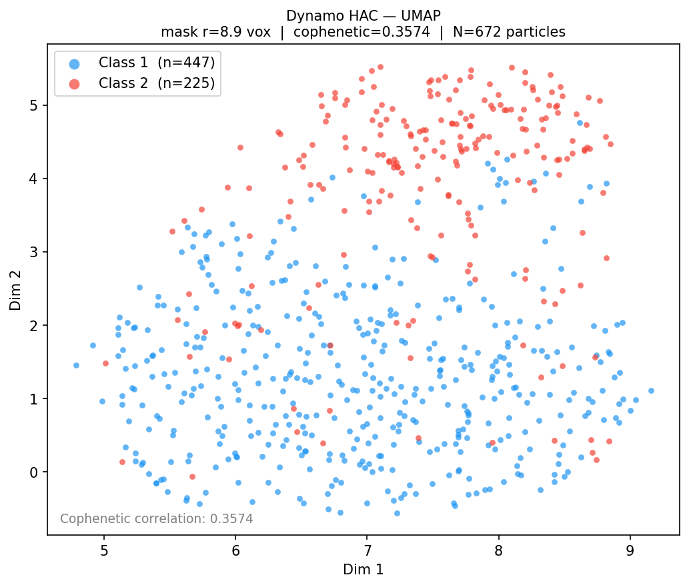
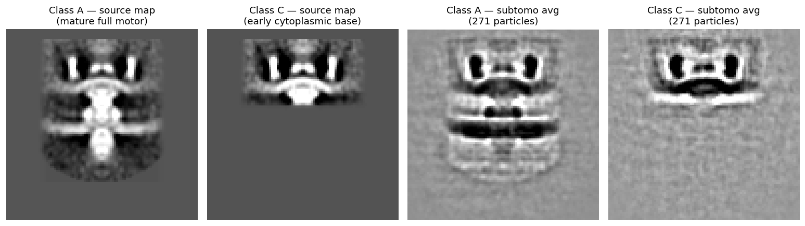
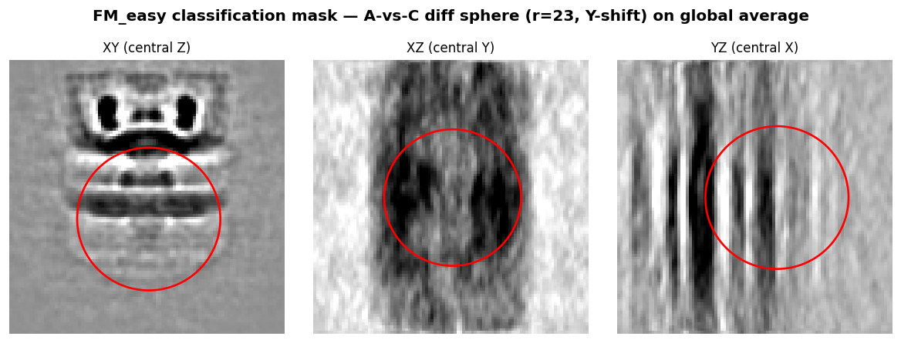
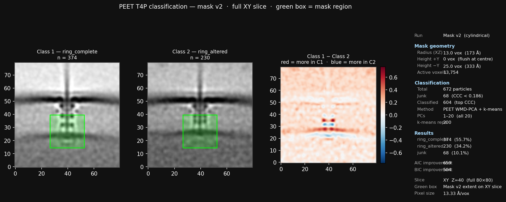
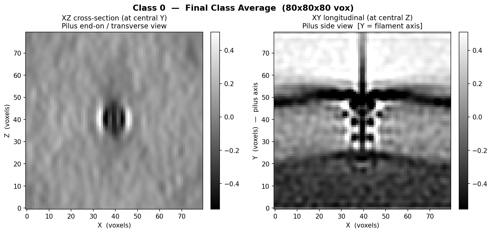

# STA Benchmark — CryoET Subtomogram Classification

**The first systematic benchmark of 3D-input subtomogram classification packages on realistic in-situ CryoET data of membrane-embedded complexes.**

> Real sparse data (500–1000 particles) · In-situ membrane-embedded targets · Expert-validated structural classes · Synthetic data with known ground-truth labels · 10+ packages evaluated

---

## Table of Contents

1. [Repository Structure](#repository-structure)
2. [Background](#background)
3. [Project Goal](#project-goal)
4. [What Makes This Benchmark Unique](#what-makes-this-benchmark-unique)
5. [Datasets](#datasets)
6. [Packages Evaluated](#packages-evaluated)
7. [Evaluation Framework](#evaluation-framework)
8. [Preliminary Findings](#preliminary-findings)
9. [Open Questions](#open-questions)
10. [Team](#team)

---

## Repository Structure

```
packages/       All 10 actively-tested classification packages.
                packages/README.md has the master progress table (all packages × all datasets).
                Each packages/<pkg>/README.md tracks that package's status, results, and next steps.

data/           T4P dataset files and QC artifacts: cylindrical masks, alignment review,
                masked averages. Large .mrc files are gitignored; only scripts and small
                outputs are committed. T4P subtomograms live at data/T4P_subtomos/ (local only).

synthetic/      Synthetic data pipeline documentation (motor_easy dataset).
                Actual simulation data lives locally at ~/Research/synthetic_sta/.

scripts/        Data-prep converters (scripts/data_prep/) and scoring tools (scripts/eval/).
                Shared utilities for building package-specific input files and computing ARI/AMI.

outputs/        Large binary classification run outputs, organized by package (gitignored).

results/        Aggregated scoring CSVs and per-package result figures (committed).

docs/           Background documents: installation guide, benchmark design framework,
                RELION algorithm notes, excluded packages list.

.session-log/   Dated session handoff logs (one file per work session).
STATUS.md       Single source of truth for project state — read before starting, update after.
```

---

## Background

### Single Particle Analysis (SPA)

SPA is the dominant cryo-EM method for determining macromolecular structure. The target complex is biochemically purified and flash-frozen in a thin ice layer, producing a sample containing billions of identical copies of the complex, each frozen in a random orientation. The electron microscope scans across different regions of this grid, collecting thousands of 2D images; each image captures many different particles, all at different orientations because of how they settled and froze. No tilting is involved — the diversity of views comes entirely from the random orientations of the particles themselves. These thousands of 2D projection images are then aligned and averaged computationally to reconstruct the 3D density map. SPA works exceptionally well — but only for complexes that can be isolated from the cell.

### CryoET and Subtomogram Averaging (STA)

Many of the most scientifically important complexes — the **Flagellar Motor**, **Type IV Pilus (T4P)**, nuclear pore complex, and others — are membrane-embedded. Trying to isolate them breaks apart the cell membrane, destroying the very structure you want to image. **Cryogenic Electron Tomography (CryoET)** solves this by imaging the entire intact cell. The sample is tilted through a series of angles (typically ±60°), and the 2D images at each tilt are computationally reconstructed into a 3D volume called a **tomogram** (`.mrc` format).

From the tomogram, the target complex is located, extracted as a small 3D subvolume (a **subtomogram**), and aligned so all copies face the same direction. Averaging hundreds of aligned subtomograms produces a 3D electron density map at higher signal-to-noise ratio. This entire pipeline is called **Subtomogram Averaging (STA)**.

Because the complex is imaged *in situ* inside an intact cell, the population of complexes spans all their natural conformational states — assembly intermediates, active/inactive forms, ligand-bound states. **Classification** is the step that sorts subtomograms into structurally distinct classes before averaging, and it is the central focus of this benchmark.

---

## Project Goal

Many packages using different classification algorithms have been developed for STA. However, **no systematic benchmarking has been done** across these packages on the same dataset with standardized preprocessing. This project creates such a benchmark using four datasets:

- **Real dataset 1:** 672 prealigned T4P subtomograms from *Vibrio* cells with expert-validated structural classes
- **Real dataset 2:** Type IV Secretion System (T4SS) — planned; details TBD
- **Synthetic dataset 1:** `FM_easy` — 2-class flagellar motor assembly intermediates (542 particles, high-contrast, exact per-particle ground-truth labels known)
- **Synthetic dataset 2:** Planned — `FM_hard`, with smaller / nested structural differences between classes (intrinsically harder for blind STA)

All packages are run with identical preprocessing on both real and synthetic data. Scores on synthetic data anchor the real-data results via ARI and related external-validity metrics.

---

## What Makes This Benchmark Unique

| Challenge | Existing benchmarks | This benchmark |
|---|---|---|
| **Target complexity** | Mostly soluble complexes (80S ribosome, etc.) that don't require CryoET | Membrane-embedded complexes (T4P, flagellar motor) — the canonical CryoET targets |
| **Particle count** | 10,000–100,000 particles | 500–1,000 particles — realistic for large membrane complexes |
| **Input dimensionality** | Mix of 2D and 3D workflows | 3D-only classifiers, isolating the subtomogram classification step |
| **Ground truth** | Computationally generated at known positions in synthetic maps | Expert structural validation against a published in-situ study of the same complex; synthetic data with exact per-particle GT labels |
| **Scope** | Individual package evaluations | Systematic head-to-head comparison with standardized I/O |

Sparse particle counts (~600–1,000) fundamentally change classification: resolution and class separation depend heavily on N, noise dominates individual particles, and instability is the primary failure mode. Existing benchmarks at 10,000+ particles simply do not test this regime.

We also recognize that limiting evaluation to 3D-input classifiers foregoes a large number of state-of-the-art packages that operate on 2D tilt-series images or 2D projections of subtomograms. These methods have grown considerably in both capability and adoption. Extending this benchmark to 2D-input classifiers is a natural and important next step.

---

## Datasets

### Real Data — Type IV Pilus (T4P), *Vibrio* sp.

**672 hand-picked, prealigned 80³ subtomograms** at 13.33 Å/px, extracted from *Vibrio* cryo-tomograms.

**Expert-validated structural classes:** The T4P pilus system in *Vibrio* exists in two distinct conformational states corresponding to different configurations of the lower periplasmic ring, as described in the published structural study of this system (Bharat lab, bioRxiv 2025 — see [preprint](https://www.biorxiv.org/content/10.1101/2025.10.14.680967v1.full), Figure 2). Expert inspection of class averages from this dataset confirms the presence of both conformational states. This serves as the qualitative reference standard against which package outputs are evaluated; while the class split ratio and exact particle assignments vary between packages and with the published result, packages whose averaged structures are consistent with both known states are considered to have "converged." Fully quantitative per-particle ground-truth labels are not yet available for this dataset.

<p align="center">
  
</p>

<p align="center"><em>Dynamo HAC classification of T4P (reference result). Two class averages consistent with the known lower periplasmic ring conformational states are recovered. Class 1: 62.7 Å (FSC=0.5); Class 2: 96.9 Å (FSC=0.5). The split ratio differs from the published study, and further quantitative validation is needed to confirm robustness.</em></p>

<p align="center">
  
</p>

<p align="center"><em>UMAP of Dynamo's cross-correlation embedding (672 particles). The two classes show partial separation in embedding space, but the overlap is substantial — the UMAP is consistent with two structural populations but is not conclusive on its own.</em></p>

---

### Synthetic Data — Flagellar Motor Assembly Intermediates (`FM_easy`)

> **Redesigned 2026-06-16 as a 2-class high-contrast set.** The original 3-class production-contrast
> set (694 particles, SNR 0.21) proved to be a *blind-failure-with-ground-truth*: **every** package
> scored ARI ≈ 0, even though the signal is present and label-recoverable. That negative result is
> itself a finding (see `docs/fm_easy_classification_analysis.md`); the dataset was then rebuilt as the
> achievable "easy tier" below. Old runs archived in `outputs/FM_easy/_archive_3class_k3/`.

**542 subtomograms** (271 + 271) simulated with ETSimulations → IMOD WBP at **13.329 Å/px, 96³ box**,
**×6 model contrast** (measured SNR ≈ 0.34). Two ground-truth classes model flagellar-motor assembly:

| Class | Description | N particles |
|---|---|---|
| **A** — full motor | Mature/extended assembly; density extends down the box | 271 |
| **C** — base only | Early cytoplasmic base; truncated (lower assembly absent) | 271 |

**Ground truth — source density maps (the two structural variants) and the GT subtomogram averages each package must recover:**

<p align="center">
  
</p>

<p align="center"><em>Central slice, dark = density. Left two: input density maps (A = full motor, C = truncated base). Right two: GT-aligned subtomogram averages (271 particles each). Individual raw particles are dominated by noise / missing-wedge artifacts — the class difference only emerges after averaging, and recovering it blind is the benchmark task.</em></p>

**Classification mask** — an A-vs-C difference sphere placed over the lower region where the classes differ:

<p align="center">
  
</p>

**Reference ceilings (on this set):** a supervised 5-fold classifier reaches **ARI 0.745 / 93% acc**, and
GT-seeded RELION reaches 0.764 — i.e. the class difference is strongly present and ~recoverable *with
labels*. Blind voxel k-means (no labels) reaches only ≈ 0.14. The gap between these is what the blind
benchmark measures. Per-particle ground-truth labels:
`~/Research/synthetic_sta/motor_easy/hc_test_x6/subtomos/merged_AC_full/labels.csv`.

---

## Packages Evaluated

We evaluate only packages that perform classification on **3D subvolumes** as input, isolating the subtomogram classification step. This excludes many modern packages that operate on 2D tilt-series data or 2D projections; a companion 2D benchmark is a natural extension.

<details>
<summary><strong>Full package status table (click to expand)</strong></summary>

Legend: ✅ done · 🟡 in progress · ⬜ not started · ❌ skipped

| Package | Status | Env | k=2 | k=3 | k=4 | T4P result | Notes |
|---|---|---|---|---|---|---|---|
| **RELION 3.1–4.0** | ✅ | `relion-5.0` | ✅ | ✅ | ✅ | Did not recover the two conformational states (CC 0.97–0.997, no discrete structural split) | Classic `relion_refine` 3D-classify path retained in RELION 5 |
| **Dynamo** | ✅ | MATLAB | ✅ | — | — | **Reference result** — recovered both conformational states (HAC 447:225) | `dynamo/` workspace |
| **PEET** | 🟡 | IMOD | 🟡 | — | — | Recovered structurally distinct classes consistent with known states (374:230, mask v2); split ratio differs from published result | Need quantitative per-particle GT to confirm |
| **PyTom** | ✅ | `pytom_env` | ✅ | ✅ | ⬜ | k=2 and k=3 class averages look structurally identical — classification not separating the two states | `PyTom/figures/` |
| **DISCA** | ✅ | `disca` | ✅ | ✅ | ✅ | One dominant ~94% class + small noisy residual at all k — did not separate the two states | Template-free deep clustering; `disca/results/` |
| **TomoFlow** | ✅ | `tomoflow` | ✅ | ✅ | ✅ | Unimodal landscape — did not separate the two states (k=3 two large-class CC 0.956) | ContinuousFlex-based; `tomoflow/results/` |
| **I3 / ProTomo** | ✅ | native | ✅ | — | — | CC = 0.921; did not recover the two states | `protomo/` |
| **EMAN2** | ✅ | `eman2` | ✅ | ⬜ | ⬜ | k=2 splits particles but not into the two known states | `~/src/eman2_project/`; k=3/4 pending |
| **OPUS-TOMO** | ✅ | `opuset` | ✅ | ✅ | ✅ | Generates multiple structured classes; structured heterogeneity captured but not aligned to known states | 4 bugs patched; `opusPatches/` |
| **STOPGAP** | 🟡 | — | ⬜ | ⬜ | ⬜ | Not yet run | **Eben's package**; optimized 6-iter schedule designed |
| **emClarity** | ✅ (installed) | MCR R2019a | — | — | — | Cannot ingest pre-extracted subtomos | **Synthetic-data track only** (tilt-series pipeline) |
| **MDTOMO** | ❌ skipped | — | — | — | — | — | Requires initial atomic model — out of scope for this benchmark |
| **HEMNMA-3D** | ❌ skipped | — | — | — | — | — | Requires initial atomic model — out of scope |
| **AC3D** | ❌ | — | — | — | — | — | Implemented as part of PyTom; results subsumed |
| **TomoNet** | ❌ rejected | — | — | — | — | — | IsoNet denoising only; no built-in classification workflow |

</details>

**PEET class averages and difference map (mask v2):**

<p align="center">
  
</p>

<p align="center"><em>PEET T4P classification (mask v2, cylindrical). Class 1 (ring_complete, n=374) vs. Class 2 (ring_altered, n=230). Full XY slice shown; red = more density in Class 1, blue = more density in Class 2. Structural differences concentrate in the ring region, consistent with the known lower periplasmic ring conformational states.</em></p>

---

## Evaluation Framework

Classification results are scored across four pillars. On **synthetic data** with known ground-truth labels, external validity metrics (ARI, AMI, per-class accuracy) anchor all results. On **real T4P data**, stability and cross-package consensus carry more weight in the absence of quantitative per-particle GT.

### Pillar 1 — External Validity vs. Ground Truth (synthetic track)
Primary metric: **ARI (Adjusted Rand Index)** — handles arbitrary class-label permutations, adjusted for chance, range [−1, 1].
Supporting: AMI (Adjusted Mutual Information), accuracy after Hungarian label matching, per-class recall.

### Pillar 2 — Downstream STA Resolution
Gold-standard FSC per class. A successful classification should yield per-class averages at higher resolution than the unsplit ensemble average.

### Pillar 3 — Stability
- **Bootstrap (80% × 20 runs):** Jaccard similarity ≥ 0.75 indicates stable classes
- **5-fold cross-validation:** ARI between held-out and full-dataset assignments
- **Noise perturbation:** label-flip rate under added Gaussian noise (0.5σ and 1σ)

### Pillar 4 — Cross-Package Consensus
Pairwise ARI/NMI between all package outputs at the same k. Dense co-occurrence blocks in the N×N particle matrix reveal classes that are robustly real across methods.

### Composite Score

Aggregate by rank-based Borda count (scales are incommensurable):

| Pillar | Weight | Rationale |
|---|---|---|
| Stability | 35% | Sparse data — stability is the primary failure mode |
| Internal validity indices | 25% | Standard complement; computed in latent space |
| Cross-package agreement | 20% | Multi-method consensus is reliable signal |
| FSC resolution gain | 20% | The biological payoff metric |

> Individual pillar rankings are always reported alongside the composite so regime-specific winners are visible.

---

## Preliminary Findings

### Real T4P

- **Dynamo and PEET are the two packages whose class averages are visually consistent with the two known lower periplasmic ring conformational states** — though this judgment is based on visual inspection of class averages against the published structural result, not quantitative per-particle ground truth. All other completed packages (RELION, PyTom, ProTomo, DISCA, TomoFlow) did not recover the two states.
- The class split ratio differs across Dynamo, PEET, and the published result, and the individual package results have not yet been validated for bootstrap stability or cross-package agreement. These are necessary before drawing strong comparative conclusions.
- OPUS-TOMO generates multiple structured classes capturing heterogeneity, but the classes are not yet mapped to the two known conformational states.

**Examples of packages that did not separate the known states:**

<table align="center">
  <tr>
    <td align="center">
      
      <br><em>TomoFlow k=2: both classes show the same pilus structure — the two conformational states are not separated</em>
    </td>
    <td align="center">
      
      <br><em>PyTom k=2 dominant class: structurally identical to the minor class — classification collapsed to one effective class</em>
    </td>
  </tr>
</table>

### Synthetic FM_easy (2-class high-contrast, blind k=2)
All 10 packages run **blind** (unsupervised, no class info) at k=2 on the 542-particle set:

| Package | ARI | Acc | | Package | ARI | Acc |
|---|---|---|---|---|---|---|
| **PEET** (WMD-PCA pc1_10) | **0.450** | 0.836 | | EMAN2 | 0.025 | 0.581 |
| **DISCA** | **0.407** | 0.819 | | RELION (blind) | 0.008 | 0.548 |
| **Dynamo** (dpkpca) | **0.254** | 0.753 | | OPUS-TOMO | 0.008 | 0.550 |
| TomoFlow | 0.036 | 0.596 | | STOPGAP | — | blocked (cluster) |
| PyTom | 0.031 | 0.590 | | | | |
| ProTomo | 0.030 | 0.589 | | | | |

- **The blind field splits cleanly:** methods that find the *class axis* (PEET many-PC, DISCA, Dynamo: ARI 0.25–0.45) vs. methods that collapse onto a *nuisance / contrast axis* (the rest: ≈ 0) — against a supervised ceiling of 0.745. The old 3-class set put *every* package at ≈ 0; this 2-class high-contrast set resolves the field.
- **Fairness:** all numbers above are blind. GT-seeded RELION (0.764, initialized from the true class averages) is reported only as a *supervised upper bound*, not in the blind ranking.
- Per-package class-average and confusion figures: `packages/README.md` (FM_easy table).

---

## Open Questions

1. **Per-particle ground-truth labels for real T4P:** Exact per-particle class assignments for the real T4P dataset are not yet available. The best available signal is structural consistency of class averages with published conformational states. Quantitative per-particle labels remain an open need for fully rigorous benchmarking on the real-data track.
2. **Missing-wedge standardization:** Whether to provide per-particle tilt geometry and let each package apply its own correction, or preprocess uniformly. *(Stefano / Braxton)*
3. **Continuous-classifier discretization:** For packages that produce continuous outputs, how to choose the discretization threshold for STA. *(Stefano)*
4. **Off-class / outlier particles:** How to handle particles that don't fit the main classes.
5. **Benchmark framework design choices:** See `benchmarkIdeas.md` §11 for five open questions on pillar weights, synthetic sweep dimensions, FSC strategy, and more.

---

## Repository Structure

```
STA/
├── subtomos_mrc/        # 672 T4P subtomograms (gitignored, .mrc)
├── outputs/             # Per-package classification outputs
├── scripts/
│   ├── data_prep/       # Input conversion scripts per package
│   └── markdown_instructions/  # Per-package usage guides
├── dynamo/              # Dynamo workspace + results
├── peet/                # PEET project files, sweep scripts, results
├── disca/               # DISCA scripts and results
├── tomoflow/            # TomoFlow scripts and results
├── PyTom/               # PyTom scripts and figures
├── protomo/             # I3/ProTomo results
├── eman2/               # EMAN2 workspace docs
├── etsimulation/        # Synthetic data pipeline docs and figures
│   └── figures/         # Synthetic data visualization outputs
├── benchmarkIdeas.md    # Full evaluation framework design doc
├── STATUS.md            # Live project state (single source of truth)
└── Package_installation.md
```

Large files (`.mrc`, `.star`, `.hdf`, `.h5`) are gitignored. Only scripts, docs, and small outputs are committed.

---

## Team

| Person | Role |
|---|---|
| **Josh Blaser** | Recent Graduate, primary researcher |
| **Eben Lonsdale** | Recent Graduate, primary researcher |
| **Stefano Maggi** | Postdoc, CryoET domain expert, manuscript review |
| **Braxton Owens** | PhD student, guidance |
| **Gus Hart** | Professor, primary advisor |
