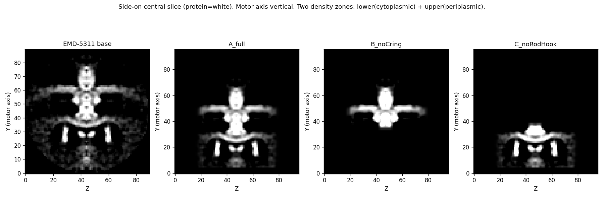
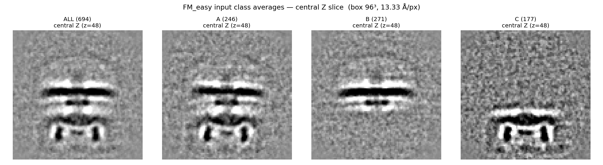
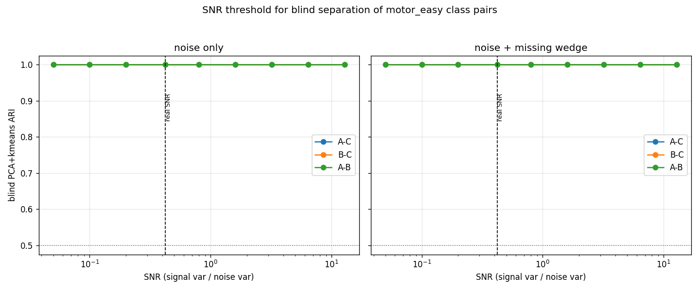
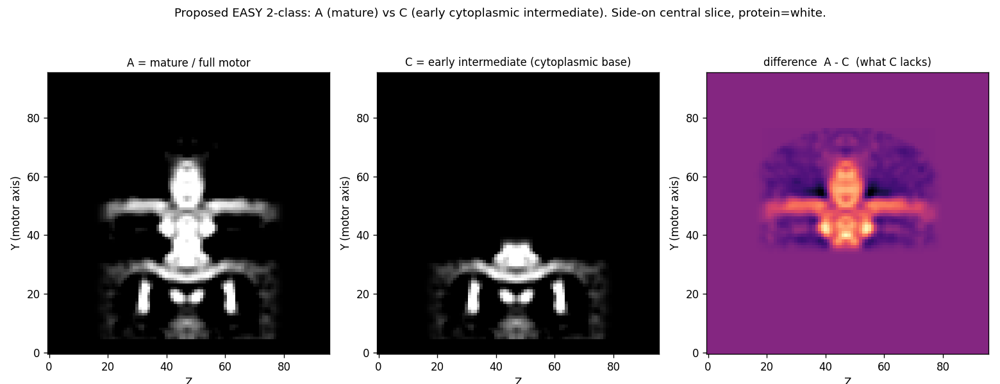

# FM_easy (motor_easy) — why blind classification fails, and what it means for design

**Date:** 2026-06-16 · **Author:** Claude (with Josh) · **Status:** analysis complete, design pending

This note documents a deep dive into *why* nearly every package fails to recover the three
FM_easy (motor_easy) classes, and what that implies for redesigning the synthetic benchmark.
All experiments used only the raw GT-aligned subtomos (`merged_all_aln/`, 96³, 13.33 Å/px) and the
clean source maps (`synthetic_sta/motor_easy/maps/class_*.mrc`). Scripts in `scripts/eval/` and
`packages/dynamo/FM_easy/scripts/`.

## 1. What the classes actually are

The three classes are **axial halves** of a C16-symmetrized in-situ flagellar motor (EMD-5311),
cut geometrically by `make_variants.py` — **not** the "C-ring edits" the original `noCring`/
`noRodHook` names imply:

- **A** (`A_full`) = **whole motor** — both membrane density plates (cytoplasmic Y≈28 + periplasmic Y≈50) + legs + periplasmic bulb.
- **B** (`B_noCring`) = **periplasmic / upper half** — only the upper plate + bulb (base y>46).
- **C** (`C_noRodHook`) = **cytoplasmic / lower half** — only the lower plate + C-ring legs (base y<46).

All three are registered to a **common frame** (verified at the single-particle level: C dark-band
median Y≈28, IQR[25,31], 96% bottom; B median Y≈50 — tight, no mis-registration). Whole-volume CCs
fit the design: A–B=0.54, A–C=0.34, **B–C=0.027** (non-overlapping halves). Total integrated density
is comparable across classes (~4.1–4.5e4) → no trivial intensity shortcut.

## 2. The signal is present — failure is representational, not data

| pair | blind masked PCA+kmeans | band-Y feature (1-D, unsupervised) | supervised 5-fold ceiling |
|---|---|---|---|
| A–B | ~0.00 | 0.02 | 0.20 |
| A–C | ~0.00 | 0.60 | 0.43 |
| B–C | 0.15 | **0.81** | 0.54 |

A *trivial* 1-D feature — the axial position of the densest membrane band (column-averaged profile →
argmin) — separates B–C at **ARI 0.81 with no labels**, while generic masked PCA gets 0.15. So the
class information is present and even simple; blind voxel methods just don't extract it. **Real
package confirmation:** Dynamo dpkpca, k=2, raw aligned subtomos + best spherical mask, gave **A–C
ARI=0.001, A–B ARI=0.026** (both chance).

## 3. Masking does not help

Tried full-motor mask, loose/tight difference masks (GT-derived), and single-region presence
detectors. Every voxel-based approach stayed ≤0.23 regardless of which voxels were kept. The mask is
not the bottleneck; the winning move (band-Y, 0.81) is a noise-averaging, contrast-invariant
*projection*, not a voxel selection. Best **spherical** mask radius (by recoverable signal):
**r≈22 px (~293 Å)** — tighter is better; larger masks just add peripheral noise.

## 4. The wall is nuisance variance, NOT SNR

In-silico sweeps on the clean maps (`snr_sweep.py`, `nuisance_sweep.py`):

| experiment (SNR=0.42 unless noted) | result |
|---|---|
| SNR sweep, idealized particles (0.05→12.8) | ARI **1.00 at every SNR** |
| azimuth-about-motor-axis spread (0→180°) | ARI **1.00 everywhere** |
| **3D misalignment jitter** (tilt+shift) | A–B dies at 20°/3px; A–C at 40°/4px; **B–C robust** |

**Photon SNR is not the limiter** — idealized particles separate at any SNR, so raising dose/SNR will
not make the dataset easier. The limiter is **structured per-particle nuisance variance** —
chiefly residual 3D misalignment (plus CTF, colored noise, WBP artifacts, true per-particle missing
wedge). The 3D-jitter sweep reproduces the real failure ordering exactly (A–B most fragile).

## 5. The deep finding

A pair's robustness tracks how **gross / spatially disjoint** its density change is: subtle additions
on shared bulk (A–B, A–C) die under realistic jitter; a disjoint change (B–C) survives. But:

> **Biologically-real assembly intermediates are *nested* (each stage adds density to the previous),
> so their differences are always "subtle additions on shared bulk" — the geometry least robust to
> alignment/wedge nuisance. The only jitter-robust geometry (disjoint density) is biologically
> impossible for an assembly series.**

So realistic in-situ assembly-intermediate classification is **intrinsically hard for blind
subtomogram averaging** — a publishable conclusion. Only GT-*seeded* RELION (0.475) ever scored,
because seeding supplies the discriminating direction the blind methods can't find.

## 6. Design implications

- **Do not raise SNR for an "easy" tier** — proven ineffective.
- **The real easy↔hard lever is nuisance-robustness**, which tracks (i) how gross/disjoint the density
  change is and (ii) how well particles can be aligned.
  - **Easy 2-class:** the largest, most spatially-distinct biologically-real change available — early
    cytoplasmic-base (C) vs mature full motor (A) — **plus the best achievable alignment**. Expect
    borderline, not trivial.
  - **Hard 3-class:** nested sequential stages (subtle additions) — guaranteed hard, the realistic point.
- **Alignment quality is a first-class benchmark variable** — likely the most effective single lever
  for an achievable easy tier.

## Reproduce

- `scripts/eval/qc_motor_easy_class_avgs.py` — class averages + central-Z montage
- `scripts/eval/pairwise_pca_kmeans_motor_easy.py` — blind/feature/supervised triad per pair
- `scripts/eval/diffmask_test_motor_easy.py` — difference-mask tests
- `scripts/eval/snr_sweep_motor_easy.py`, `nuisance_sweep_motor_easy.py` — SNR & nuisance sweeps
- `packages/dynamo/FM_easy/scripts/{setup_easy_pair_pca.py, dynamo_easy_pair_pca.m, score_easy_pair.py}` — real-package k=2 pair runs
