# Packages — Benchmark Progress

This directory contains all 10 actively-tested classification packages. Each package has its
own subdirectory organized into per-dataset workstreams (`T4P/`, `FM_easy/`, `FM_hard/`, `T4SS/`).

See [docs/datasets.md](../docs/datasets.md) for the authoritative protocol: k values, masks,
junk class handling, naming convention, and missing-wedge policy.

See [docs/excluded-packages.md](../docs/excluded-packages.md) for packages evaluated but not
included in the benchmark.

---

## Progress Matrix

Legend: ✅ done · 🟡 in progress · ⬜ not started · ❌ skip · — not applicable

### T4P Real Dataset (672 pre-aligned 80³ subtomograms, 13.33 Å/px)

**Protocol:** k=3 total (2 signal + 1 junk), cylindrical mask v2 (r=13, h_pos=0, h_neg=25),
no alignment step. OPUS-TOMO uses threshold mask (package-level exception — VAE cannot use
tight cylindrical). See `docs/datasets.md` for junk class handling per package.

**Reference class averages (Stefano — ring_complete / ring_altered / junk, 509/95/68):**

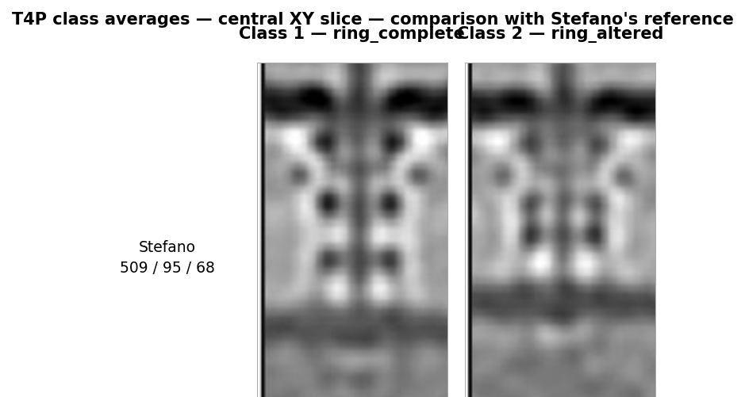

| Package | T4P Status | Result (signal classes) | Mask | Converged? | Class Avgs | Notes |
|---------|-----------|------------------------|------|------------|------------|-------|
| [Dynamo](dynamo/) | 🟡 | 447/225 (junk pending) | cyl v2 (pending re-run) | **Yes** | 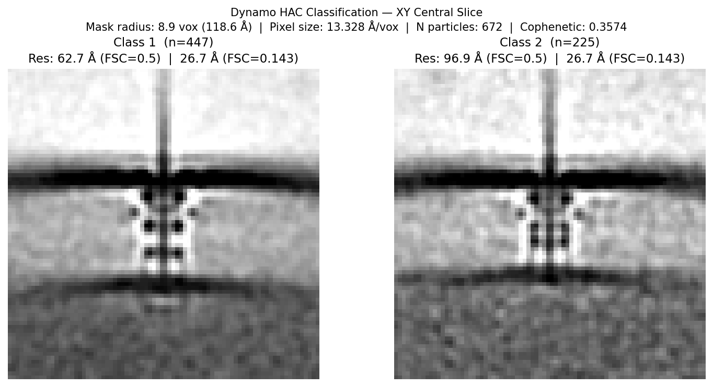 | HAC; reference result; re-run needed with k=3+junk |
| [PEET](peet/) | ✅ | **374/230** (+68 junk) | cyl v2 | **Yes** | 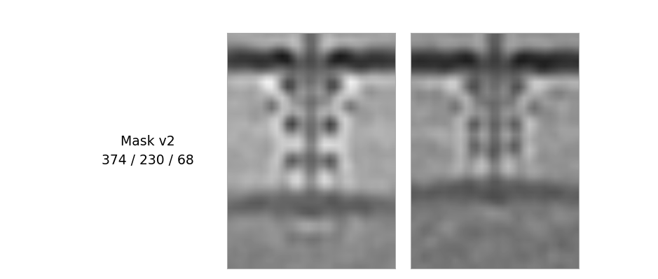 | Cyl mask v2 critical; junk class = bottom 68 by CCC |
| [PyTom](PyTom/) | 🟡 | 440/232 (junk pending) | cyl v2 | **Yes** | 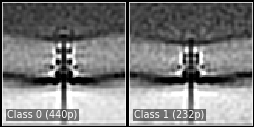 | `-a` flag + v2 mask both required; re-run needed with k=3+junk |
| [OPUS-TOMO](opusTomo/) | 🟡 | 447/225 (junk pending) | threshold (31.2%) | **Partial** | _(pending)_ | Threshold mask required for VAE; junk pending; ARI vs GT pending |
| [RELION](relion/) | ✅ (exhausted) | 672/0 | cyl v2 | **No** | — | Algorithm-level SNR failure; all configs collapse |
| [EMAN2](eman2/) | ✅ | 270/317 (+85 junk) | none | **No** | 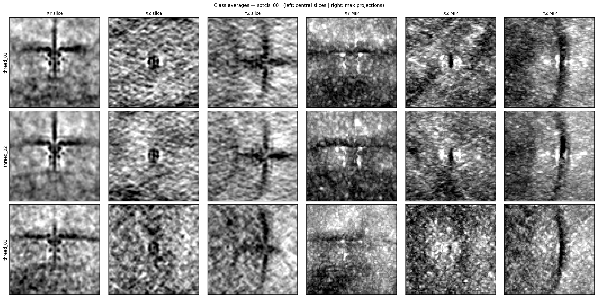 | Canonical k=3 complete; does not separate two phases; PCA axis = contrast, not conformation |
| [DISCA](disca/) | ✅ | **398/274** (cyl v2) | cyl v2 | **No** | 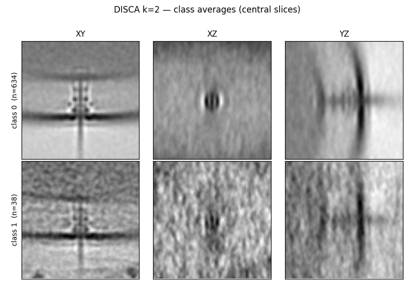 | Masked: balanced split but ARI≈0 vs converging pkgs; splits on contrast axis. Agrees w/ OPUS-TOMO (ARI=0.678). Misses the two phases |
| [TomoFlow](tomoflow/) | 🟡 | — (old run) | none | **No** | 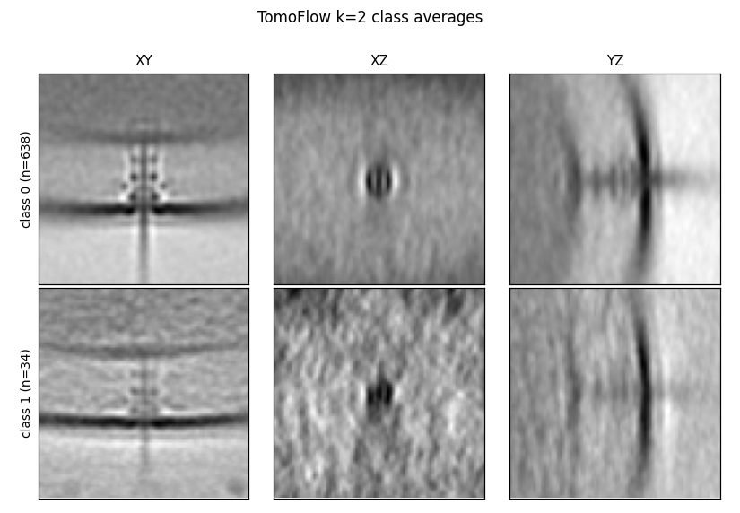 | Unimodal; k=3 canonical run needed |
| [ProTomo](protomo/) | ✅ | 334/212/126 junk (all 672) | none | **Yes** | 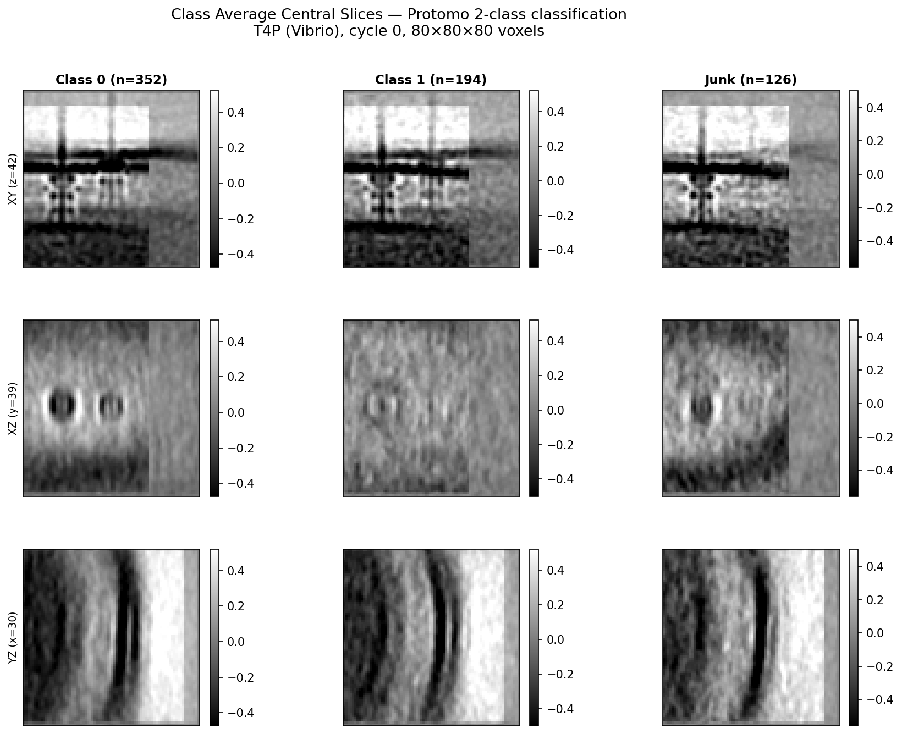 | Separates the two phases (visual). CC=0.943. MRAPKR=0 bug fixed (shifting 437 particles +22px); alignment bypassed. |
| [STOPGAP](STOPGAP/) | ✅ | PCA 336/336 · MRA **70/602** (k=2) | cyl (tight r=8/h=26) | **No** | 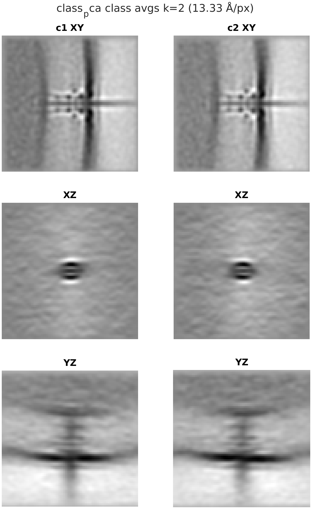 | Owned by Eben; k=2/3/4 done (job 12114811). PCA k-means vs MRA disagree at chance (ARI≈0.001–0.003); does not separate the two phases |

---

### Synthetic Dataset — FM_easy (694 particles, 3 classes, 30 Å differences)

> Class C redesigned 2026-06-05 (C_noRodHook = C-ring only). A=246, B=271, C=177.
> All scores use new C_noRodHook definition.
> **Protocol:** k=3, no junk class. Mask: TBD (see `docs/datasets.md`).

**Perfect confusion matrix (ARI = 1.0):**

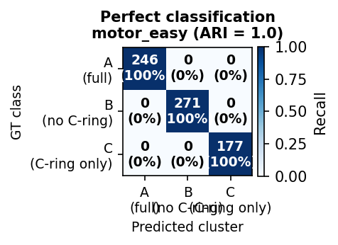

| Package | FM_easy Status | k=3 ARI | Best Confusion | Notes |
|---------|---------------|---------|----------------|-------|
| [RELION](relion/) | ✅ | **0.475** (iter 1 GT) / 0.006 (blind) |  | GT-seeded upper bound only; collapses by iter 2 |
| [PEET](peet/) | ✅ | 0.050 (k=3); **0.116** (k=2 best) |  | WMD-PCA limitation on uniform-wedge stacks |
| [Dynamo](dynamo/) | ✅ | **0.200** (k=3 dpkpca) | 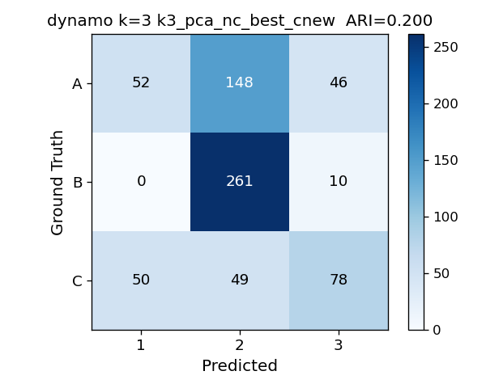 | dpkpca nc=17; class B 96–99% pure |
| [OPUS-TOMO](opusTomo/) | ✅ | 0.021 | 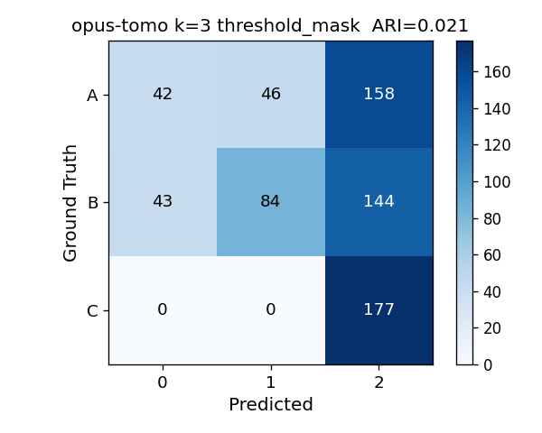 | Class C isolated; A/B unseparated |
| [PyTom](PyTom/) | ✅ | **0.134** (k=3) |  | v2 cyl mask |
| All others | ⬜ | — | ⬜ | EMAN2, DISCA, TomoFlow, ProTomo, STOPGAP not yet run |

---

### Synthetic Dataset — FM_switch (451 particles, 2 classes + junk, ~15–25 Å differences)

> Borrelia burgdorferi flagellar motor CCW↔CW rotational switching (EMD-21884/21886, Chang et al. 2020).
> Re-simulated at 5 Å/px, 160³. 208 CCW + 208 CW + 35 junk = 451 particles. GT-avg CC=0.615.
> **Protocol:** k=2 (CCW vs CW, exclude junk from ARI). Mask: RELION ellipsoidal (r_xz=38, r_y=65 + soft edge).

| Package | FM_switch Status | k=2 ARI | Best Confusion | Notes |
|---------|-----------------|---------|----------------|-------|
| [RELION](relion/) | ✅ | **0.379** (iter 1 GT) | 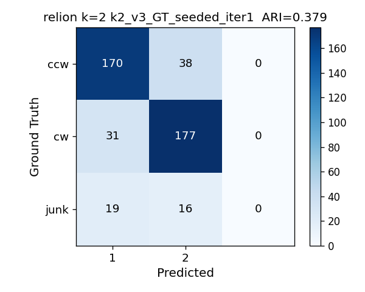 | GT-seeded+firstiter_cc+skip_align; collapses to ARI≈0 by iter5 |
| [PEET](peet/) | ✅ | **0.007** (k=2 pc1_10) | 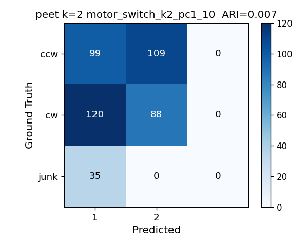 | WMD-PCA ARI≈0; CCW/CW equally split; same limitation as FM_easy |
| [Dynamo](dynamo/) | ⬜ | — | ⬜ | Not yet run |
| [OPUS-TOMO](opusTomo/) | ⬜ | — | ⬜ | Not yet run |
| [PyTom](PyTom/) | ⬜ | — | ⬜ | Not yet run |
| All others | ⬜ | — | ⬜ | EMAN2, DISCA, TomoFlow, ProTomo, STOPGAP not yet run |

---

### FM_hard (Planned) and T4SS (Planned)

No runs yet. See `docs/datasets.md` for planned parameters.

---

## Package Descriptions

| Package | Algorithm | Environment | Key Characteristic |
|---------|-----------|-------------|-------------------|
| **Dynamo** | HAC on PCA-reduced subtomogram distances | MATLAB | Reference result for T4P; recovers both conformational states |
| **PEET** | PCA + k-means with cylindrical masks; WMD weighting | IMOD | Best result with cyl v2 mask; built-in CCC-based junk class |
| **PyTom** | FRM-based rotational alignment + k-means with cylindrical focus mask | `pytom_env` | Requires `-a` flag and v2 mask; both critical |
| **OPUS-TOMO** | Variational autoencoder (VAE) continuous latent-space clustering | `opuset` (cu128 PyTorch) | 4 bugs patched; threshold mask required (cyl too restrictive for VAE) |
| **RELION** | Soft EM (3D maximum-likelihood classification) | `relion-5.0` | Algorithm-level failure on low-SNR T4P; FM_easy GT-seeded ARI=0.475 |
| **EMAN2** | PCA split on subtomogram stack | `eman2` (Josh + Eben) | T4P k=3 canonical done; PCA captures contrast axis, not conformation |
| **DISCA** | Template-free deep unsupervised clustering (pytorch) | `disca` | Unmasked: ~94% dominant class. Masked (cyl v2): balanced 398/274 but ARI≈0 vs converging pkgs — clusters on contrast axis, agrees w/ OPUS-TOMO (0.678) |
| **TomoFlow** | ContinuousFlex optical-flow conformational classification | `tomoflow` | Unimodal landscape; CUDA texture-ref porting for sm_120 |
| **ProTomo (I3)** | Iterative alignment + multi-reference classification | native binary | Full-672 rerun complete 2026-06-09; CC=0.921 trivial (same as 234-particle run) |
| **STOPGAP** | Subtomogram averaging + PCA + k-means (MATLAB MCR) | MATLAB R2023b MCR | Owned by Eben; T4P k=2/3/4 complete (2026-06-09); does not separate two phases (ARI≈0); FM/T4SS pending |

---

## Packages Not Tested

See [docs/excluded-packages.md](../docs/excluded-packages.md) for TomoNet, emClarity, MDTOMO, HEMNMA-3D, and AC3D.

---

## How to Update This File

After any result changes:
1. Update the relevant row in the Progress Matrix above
2. Update `packages/<pkg>/README.md` results summary table

See `docs/datasets.md` for naming convention and canonical parameters.
See `CLAUDE.md` §"Package README Protocol" for the full update rule.
