# Packages — Benchmark Progress

This directory contains all 10 actively-tested classification packages. Each package has its
own subdirectory organized into per-dataset workstreams (`T4P/`, `FM_easy/`, `FM_hard/`, `T4SS/`).

See [docs/datasets.md](../docs/datasets.md) for the authoritative protocol: k values, masks,
junk class handling, naming convention, and missing-wedge policy.

See [docs/excluded-packages.md](../docs/excluded-packages.md) for packages evaluated but not
included in the benchmark.

---

## Progress Matrix

Legend: ✅ done · 🟡 in progress · ⬜ not started · ❌ skip · — not applicable

### T4P Real Dataset (672 pre-aligned 80³ subtomograms, 13.33 Å/px)

**Protocol:** k=3 total (2 signal + 1 junk), cylindrical mask v2 (r=13, h_pos=0, h_neg=25),
no alignment step. OPUS-TOMO uses threshold mask (package-level exception — VAE cannot use
tight cylindrical). See `docs/datasets.md` for junk class handling per package.

**Classification mask (cylindrical v2, red contour on the global average):**

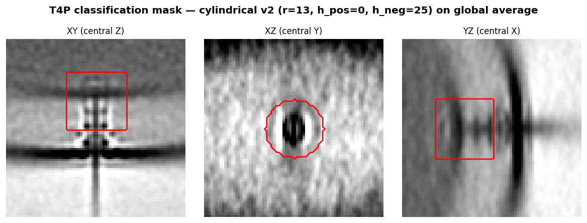

**Reference class averages (Stefano — ring_complete / ring_altered / junk, 509/95/68):**

**Cross-package comparison — all 10 packages** (`scripts/eval/gen_t4p_full_pkg_grid.py`):

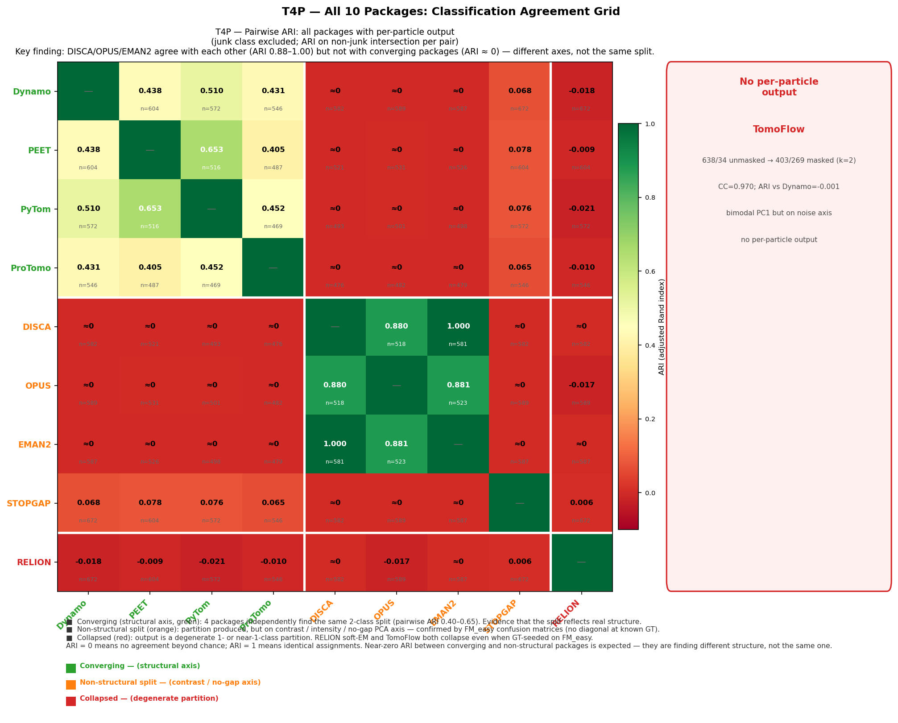

Three failure modes are visible in the grid. (1) **Converging** (green, top-left block): Dynamo/PEET/PyTom/ProTomo agree with each other at ARI 0.40–0.65 — 4 independent algorithms finding the same structural split. (2) **Non-structural split** (orange, middle block): DISCA/OPUS/EMAN2 agree *with each other* at ARI 0.88–1.00 but show ARI≈0 against the converging group — they find the same contrast/intensity axis, which is reproducible but biologically different from the conformational split. STOPGAP finds no discrete gap (continuous PCA axis, ARI≈0 against all). (3) **Collapsed** (red): RELION soft-EM (16/656) and TomoFlow (collapsed; ARI≈0 vs Dynamo on both masked and unmasked runs) produce degenerate partitions; RELION is shown in the grid. See `docs/benchmarkIdeas.md §12` for the full no-GT evidence chain.

**Deep-dive: 4 converging packages** (`scripts/eval/gen_cross_pkg_correlation.py`):

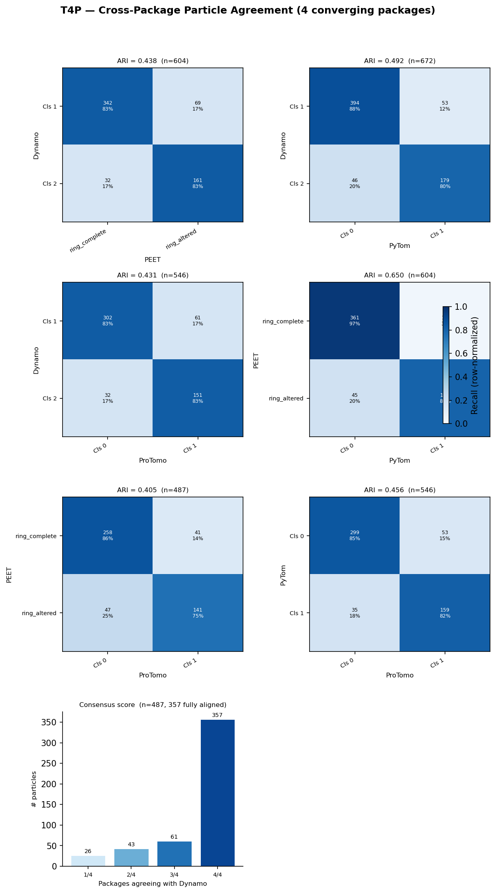

**Junk class status:** ✅ PEET (68), EMAN2 (85), ProTomo (126), **PyTom (100, FSC-confirmed)**; ✅ **Dynamo (68)**, ✅ **DISCA (90)**, ✅ **OPUS (83)**; STOPGAP: k=2 PCA k-means CSV now exists (`stopgap_k2_std.csv`, 385/287, ARI=0.07 vs Dynamo — non-structural, no junk class). All 10 packages now have per-particle T4P output. See `docs/datasets.md §Junk Class Protocol`.

**FSC comparison (unsplit baseline vs Dynamo classes vs PyTom junk verification):**

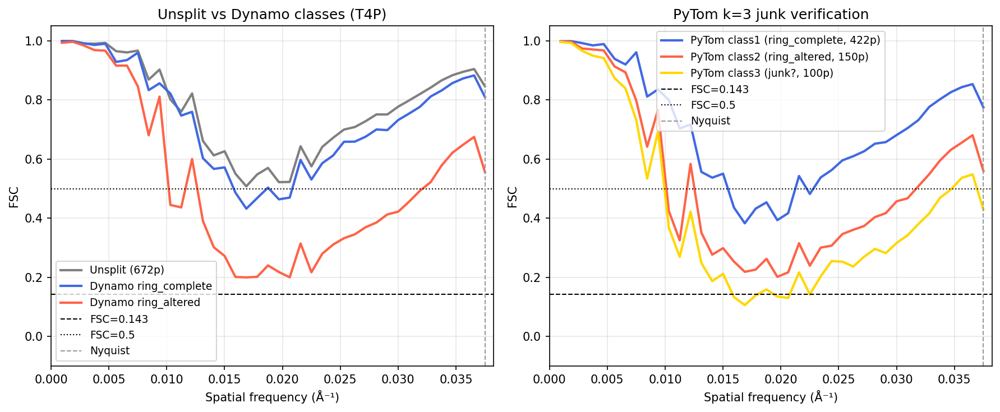

*Left: the unsplit average (all 672p) stays above FSC=0.5 to Nyquist — the two classes share the same gross structure. Splitting into ring_complete/ring_altered recovers class-specific features (FSC=0.5 at 63–98 Å). Right: PyTom class 3 (100p) is confirmed junk — FSC=0.143 at 63.2 Å, clearly distinct from signal classes (both at Nyquist 26.7 Å). See `results/T4P/fsc_summary.csv` for full table.*

Class-average panels below use XY central slice only; particle counts labeled. All figures generated by `scripts/eval/gen_t4p_class_avg_panels.py` from standardized CSVs in `results/T4P/`.

| Package | T4P Status | Result (signal + junk) | Mask | Converged? | Class Avgs | Notes |
|---------|-----------|------------------------|------|------------|------------|-------|
| [Dynamo](dynamo/) | ✅ | **447/157** (+68 junk ✅) | cyl v2 | **Yes** | 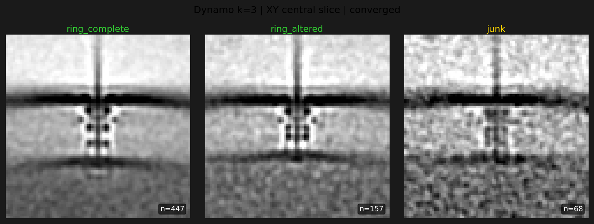 | Ward HAC; k=3 re-cut from existing CC matrix (no recompute); junk=68p split from ring_altered; k=2 signal split was 447/225 (157+68); std CSVs: `dynamo_k2_std.csv` (signal), `dynamo_k3_std.csv` (k=3+junk) |
| [PEET](peet/) | ✅ | **374/230** (+68 junk ✅) | cyl v2 | **Yes** | 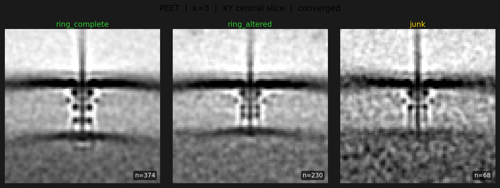 | Cyl mask v2 critical; junk = bottom 68 by CCC (computed from particles); std CSV: `peet_k3_std.csv` |
| [PyTom](PyTom/) | ✅ | 422/150 (+100 junk ✅) | cyl v2 | **Yes** | 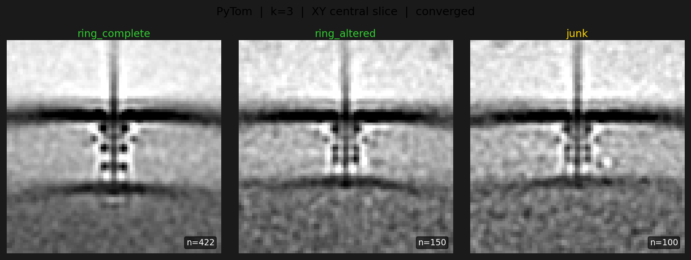 | k=3; class 3 (100p) **FSC-confirmed junk** (63.2 Å vs 26.7 Å for signal); std CSV: `pytom_k3_std.csv` |
| [OPUS-TOMO](opusTomo/) | ✅ | **368/221** (+83 junk ✅) | threshold (31.2%) | **Partial** | 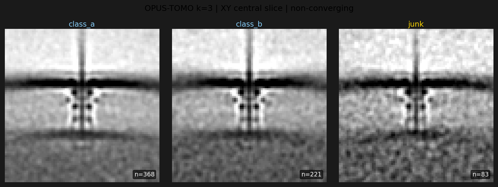 | k=3 retrained (20 epochs, RTX 5080); junk=83p; threshold mask required for VAE; contrast-axis split; std CSV: `opus_k3_std.csv` |
| [RELION](relion/) | ✅ (exhausted) | 672/0 | cyl v2 | **No** | — | Algorithm-level SNR failure; all configs collapse |
| [EMAN2](eman2/) | ✅ | 270/317 (+85 junk ✅) | auto-tight | **No** | 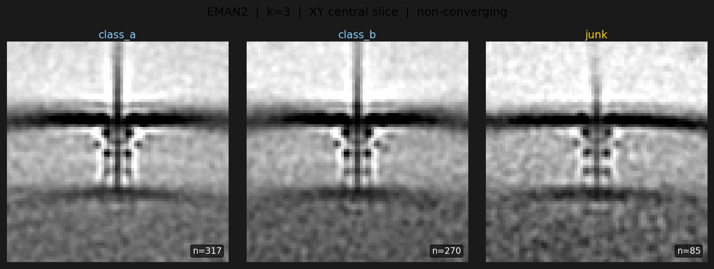 | k=3 + `--clean`; junk = PCA outliers. Does not separate phases. std CSV: `eman2_k3_std.csv` (index→filename mapping applied) |
| [DISCA](disca/) | ✅ | **315/267** (+90 junk ✅) | cyl v2 | **No** | 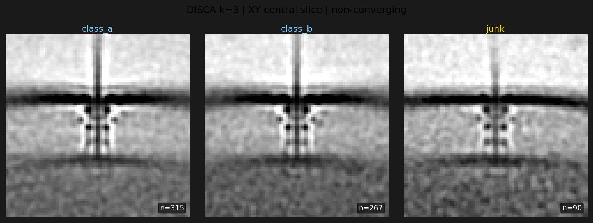 | k=3 cyl v2; junk=90p; contrast-axis split (ARI≈0 vs converging pkgs); std CSV: `disca_k3_std.csv` |
| [TomoFlow](tomoflow/) | ✅ | 403/269 masked (k=2) | cyl v2 (**mask confirms no help**) | **No** | 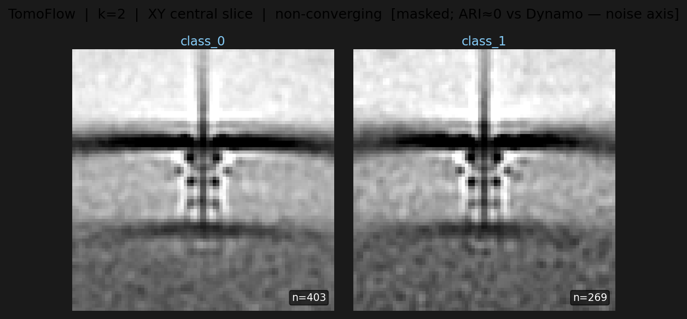 | Bimodal PC1 but ARI=-0.001 vs Dynamo — split on noise/wedge axis. CC=0.970 masked. |
| [ProTomo](protomo/) | ✅ | 334/212 (+126 junk ✅) | none | **Yes** | 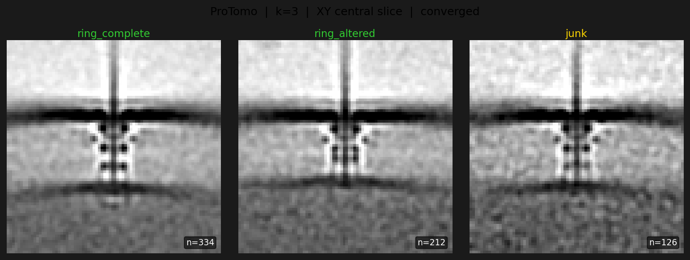 | CC=0.943; junk extracted via `--include-junk` flag; std CSV: `protomo_k3_std.csv` |
| [STOPGAP](STOPGAP/) | 🟡 | PCA 336/336 · MRA **70/602** (k=2) | cyl **r=8/h=26** (≠ v2) | **No** |  | Eben's; **mask differs from canonical v2** (r=8 vs r=13); **no per-particle class CSV** — only PCA eigenfactors |

#### T4P Class Average Gallery

Full-size class averages for every package. Each panel = XY central slice of the mean subtomogram for that class; particle counts labeled. Packages grouped by whether they recover the two known pili-phase conformations.

**Reference (Stefano expert split) — ring\_complete 509 / ring\_altered 95 / junk 68**

---

**Converging packages** — recover the ring\_complete / ring\_altered conformational split

**Dynamo** ✅ — 447 ring\_complete / 157 ring\_altered / 68 junk (k=3, Ward HAC)

**PEET** ✅ — 374 ring\_complete / 230 ring\_altered / 68 junk (k=3, WMD-PCA, cyl v2)

**PyTom** ✅ — 422 ring\_complete / 150 ring\_altered / 100 junk FSC-confirmed (k=3, cyl v2)

**ProTomo** ✅ — 334 ring\_complete / 212 ring\_altered / 126 junk (k=3, SVD+HAC, CC=0.943)

---

**Non-converging packages** — split on a contrast axis or collapse entirely

**OPUS-TOMO** — 368 / 221 / 83 junk (k=3, threshold mask; contrast-axis split, ARI≈0 vs converging)

**EMAN2** — 270 / 317 / 85 junk (k=3, auto-tight mask; PCA captures intensity not conformation)

**DISCA** — 315 / 267 / 90 junk (k=3, cyl v2; contrast-axis split, high ARI with OPUS-TOMO 0.678)

**TomoFlow** — bimodal PC1 landscape (masked run), but **ARI=-0.001 vs Dynamo** — the split axis is noise/missing-wedge, not structural.
k=2 unmasked: 638/34 (CC=0.840) → k=2 masked: 403/269 (CC=0.970, ARI≈0). Collapsed in both configurations.

**STOPGAP** — PCA k=2 split 336/336 (equal halves of a continuous PC axis; Eben's run; mask differs from canonical v2)

**RELION** — algorithm-level failure; soft-EM collapses to 672/0 under all tested configurations; no class averages.

---

### Synthetic Dataset — FM_easy (REDESIGNED 2026-06-16: 542 particles, 2 classes, high-contrast)

> **Redesigned 2026-06-16.** Old 3-class 694p production-contrast set (every package ARI≈0) archived
> in `outputs/FM_easy/_archive_3class_k3/`. New = **2-class A (mature full motor) vs C (early
> cytoplasmic base), 271+271=542 particles, ×6 contrast (SNR 0.340), 96³, 13.329 Å/px**, GT-aligned.
> **Protocol:** k=2, no junk. Mask: A-vs-C diff sphere `diff_sphere_r23_y55.mrc`.
> Reference ceilings on this set: blind masked-PCA ARI≈0.14; supervised 5-fold ARI≈0.75 / 93% acc.
> **All package numbers below are BLIND (unsupervised, no class info)** — equal footing.

**Ground truth — source density maps (input) and subtomogram averages of each class:**

*(Central slice, dark = density. Class A = mature full motor, density extends down the box;
Class C = early cytoplasmic base, truncated. The two subtomo averages are what each blind package
is trying to recover.)*

**Classification mask (A-vs-C diff sphere, red contour on the global average):**

The **Class averages** column shows each package's two predicted clusters (mean of the subtomos it
assigned to each), same central slice — a package "finds the class axis" when its two averages look
like the A and C panels above (one full motor, one truncated).

**Perfect classification reference (ARI = 1.0) — what a confusion-column entry looks like at the top of the table:**

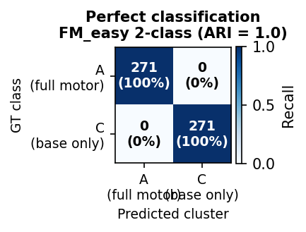

| Package | k=2 ARI (blind) | Acc | Class averages (2 predicted clusters) | Confusion | Notes |
|---------|-----------------|-----|---------------------------------------|-----------|-------|
| [PEET](peet/) | **0.450** (pc1_10) | 0.836 | 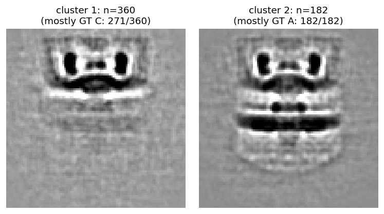 | 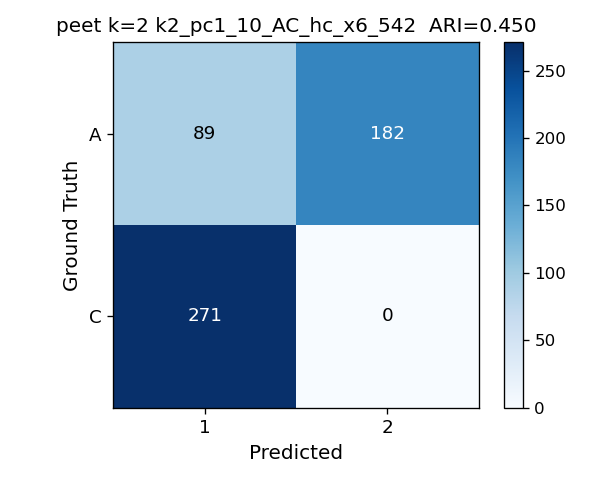 | diff sphere. WMD-PCA recovers axis with more PCs (pc1_3=0.08, pc1_5=0.12, pc1_10=0.45); cluster averages match A/C |
| [DISCA](disca/) | **0.407** | 0.819 | 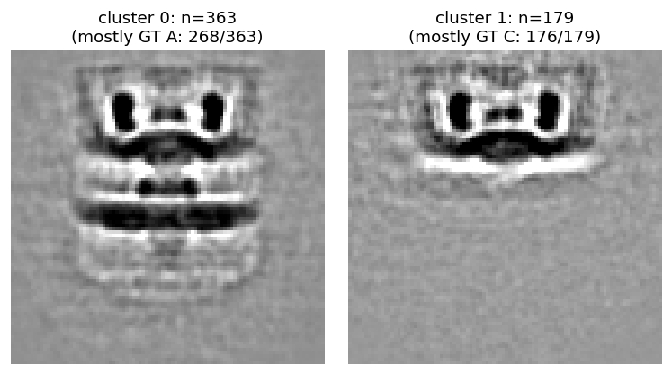 | 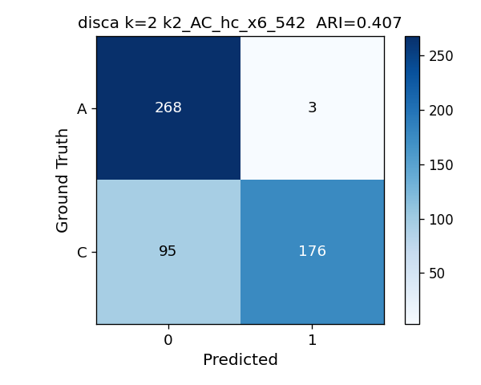 | diff sphere. Locks onto structural axis at high contrast (was 0.036 at k=3); A 268/3 pure |
| [PyTom](PyTom/) | **0.262** | 0.757 | 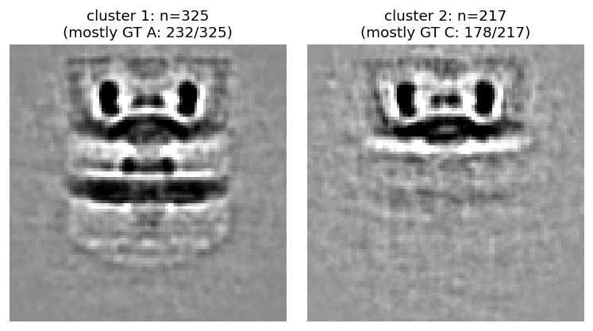 | 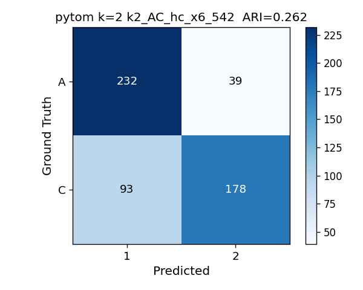 | **CYLINDER mask** (r27 h24, adopted 2026-06-17 — CC/template method prefers a tight focus mask; converged iter6). Was **0.031** on the diff sphere. |
| [Dynamo](dynamo/) | **0.254** | 0.753 | 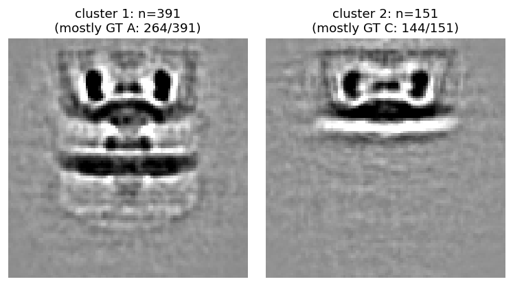 | 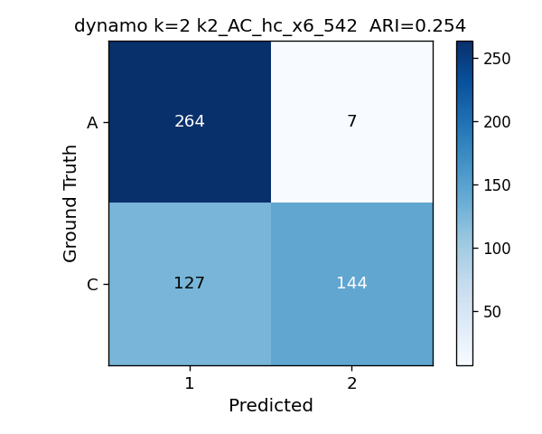 | diff sphere. dpkpca band[0.05,0.45,2] 50 eig; 95%-pure C cluster |
| [EMAN2](eman2/) | **0.146** | 0.692 | 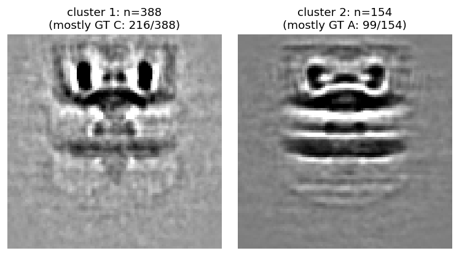 |  | diff sphere (re-run 2026-06-17; was 0.025 with auto-tight mask). 438/104; class C 271/0 pure — partial recovery |
| [ProTomo](protomo/) | 0.053 | 0.616 | 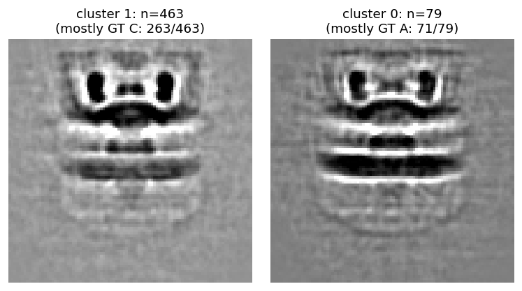 | 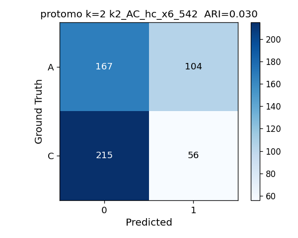 | diff sphere (re-run 2026-06-17; was 0.030 with solvent sphere). SVD+HAC; small A-enriched cluster (79: 71A/8C) |
| [TomoFlow](tomoflow/) | 0.036 | 0.596 | 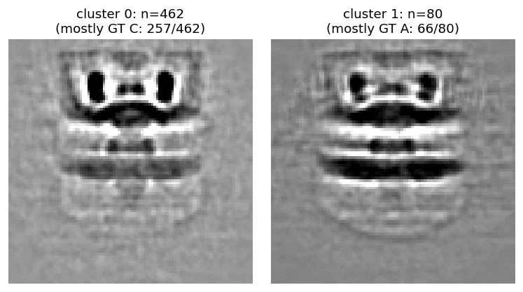 | 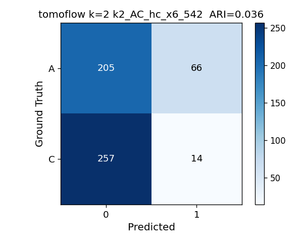 | **no mask** (OF on full volume). Landscape collapses (downsample 3 / 32³); unimodal, as on T4P |
| [RELION](relion/) | 0.008 (blind) | 0.548 | 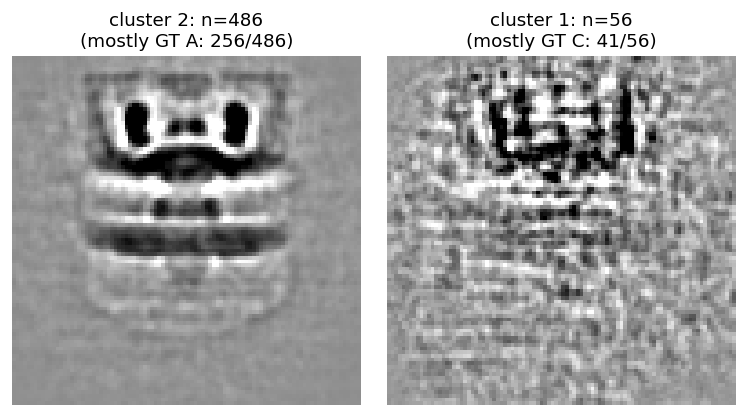 |  | solvent sphere (21%, *required* for solvent flattening). Soft-EM blind: near-collapse 486/56 — SNR failure |
| [OPUS-TOMO](opusTomo/) | 0.008 | 0.550 | 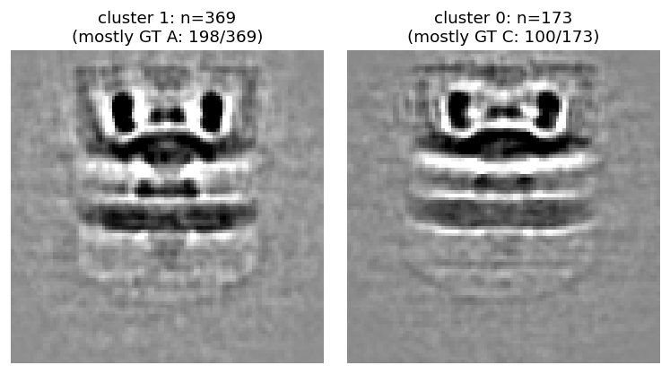 | 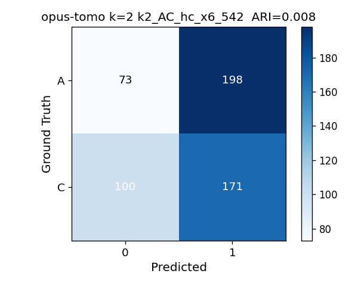 | threshold mask (15%, *required* for VAE). Latent does not resolve the 2 classes |
| [STOPGAP](STOPGAP/) | _blocked_ | | — | — | Needs `/apps/matlab/r2023b` (BYU RC cluster); SLURM-only on this node — run via Eben on the cluster |

> **Mask policy:** the canonical FM_easy mask is the **A-vs-C diff sphere** (8.7% of box, shown above), used by
> PEET, DISCA, Dynamo, EMAN2, and ProTomo. Per-package exceptions: **PyTom** uses a **cylinder** (r27 h24, 9.9%;
> the CC/template method gains a lot from a tight focus mask — 0.031→**0.262**, while every PCA method got
> *worse* with it); **RELION** needs a broad solvent-flattening mask (21%); **OPUS-TOMO** needs a broad
> threshold mask for the VAE (15%, a tight mask collapses it); **TomoFlow** has no mask step (optical flow on
> the full volume). All masks are the same 96³ box. *(Cylinder-vs-sphere sweep recorded under `*_CYL` tags in
> `results/synthetic_scores.csv`; the cylinder helped only PyTom and hurt PCA methods — DISCA 0.41→0.005,
> Dynamo 0.25→0.00 — because the A-vs-C signal extends axially and the cylinder crops it.)*

**Supervised upper bounds (reference only — NOT blind, excluded from the ranking):**

| Reference | ARI | Acc | Notes |
|-----------|-----|-----|-------|
| RELION **GT-seeded** (iter1) | 0.764 | 0.937 | Initialized from the true A & C class averages (`--firstiter_cc`) — effectively supervised; collapses to 0.435 by iter2 |
| Logreg 5-fold ceiling | 0.745 | 0.932 | Supervised classifier on masked-PCA features (`align_classify_full.py`) |

**Benchmark signal:** at high contrast the BLIND field splits between methods that recover the *class axis*
(PEET, DISCA, PyTom, Dynamo: ARI 0.25–0.45; EMAN2 0.15 partial) and those that collapse onto a
*nuisance/contrast axis* (ProTomo, TomoFlow, RELION soft-EM, OPUS: ARI≈0–0.05) — even though the supervised
ceiling is 0.75. The old 3-class set put *every* package at ≈0; this 2-class hc set resolves the blind field.
(Masks: diff sphere for all except PyTom=cylinder, RELION/OPUS=broad, TomoFlow=none — see Mask policy above.)

#### Do packages misclassify the *same* subtomos?

Mostly **no** — and that is itself a result. Per-particle errors (best-permutation map of each package's
clusters to GT) were compared across all 9 blind packages (`scripts/eval/fm_easy_error_overlap.py`):

- **No particle is missed by all 9** packages (max 7/9, only 4 particles); errors are spread across the
  set (modal miss-count 3–4 of 9), not concentrated on a small universally-hard subset.
- **The three recovering packages miss nearly disjoint sets.** PEET–DISCA error overlap = **Jaccard 0.00**,
  PEET–Dynamo 0.02 — *below* the chance level expected if their errors were independent (0.09–0.11). **0
  particles are missed by all three** of PEET/DISCA/Dynamo. So a consensus of these three would correct
  almost everything — the methods are complementary, keying on different parts of the signal.
- The **collapsed** packages overlap much more with each other (TomoFlow/ProTomo/EMAN2 Jaccard ≈ 0.48–0.54)
  because they all fail on the same class (whichever collapses), not because they share *hard particles*.

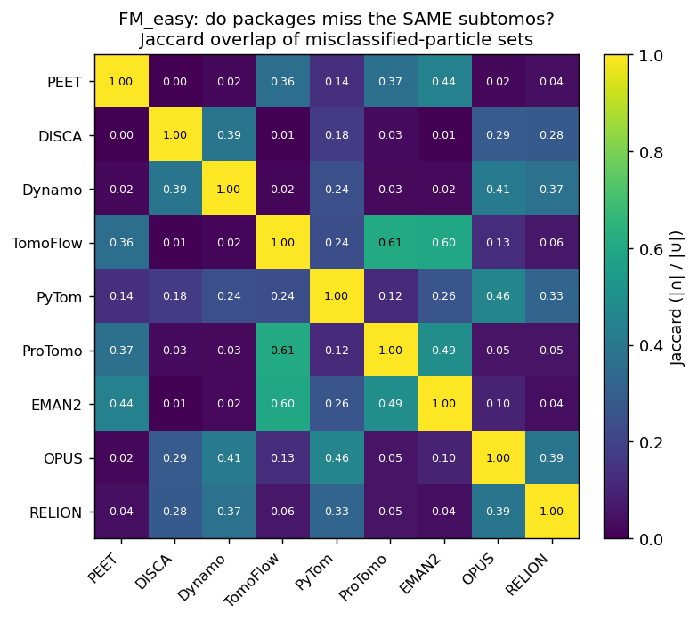

**Top-5 most-missed subtomos** (highest miss-count across the 9 packages; each panel = average of the 10
central Z-slices of that subtomogram). These are dominated by heavy missing-wedge streaking / low local
SNR — i.e. the hardest particles are degraded reconstructions, not a particular conformation (mix of GT A & C):

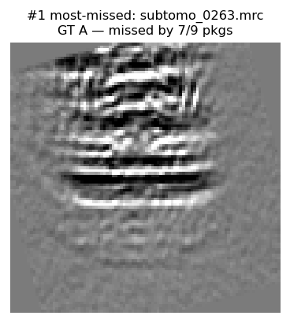
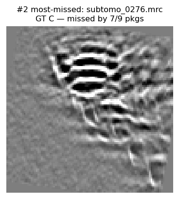
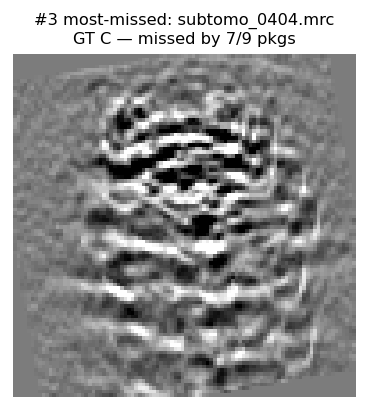
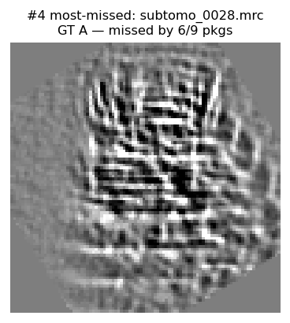
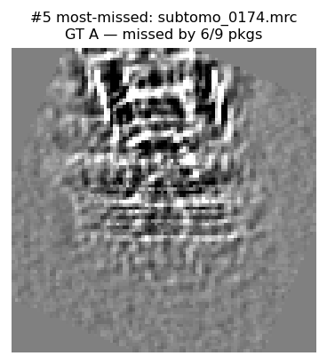

---

### Synthetic Dataset — T3SS Injectisome (415 particles, 2 signal classes + junk)

> **T3SS injectisome sorting-platform presence/absence** (EMD-8544, Hu et al. 2017 Cell).
> ETSim-simulated at 13.33 Å/px, 48³ box, AMP=1.5.
> **class_B** (215p): IM ring + sorting platform present (full injectisome base).
> **class_C** (120p): IM ring absent (partially assembled state).
> **junk** (80p): background-noise particles (no structure). Total = 415.
> **Protocol:** k=2 or k=3 (best k used per package); ARI scored on signal particles only
> (class_B + class_C, excluding junk). Classification mask: cylinder R=20, ZC=24, XC=24, Y=[2,27]
> in 48³ box. **DISCA alone shows non-trivial ARI — all PCA/alignment methods collapse (registration wall).**
> Structurally distinct from FM_easy (different complex, different fold) — provides geometric diversity
> to the benchmark beyond flagellar motors.

**Ground truth — source density maps and subtomogram averages of each class:**

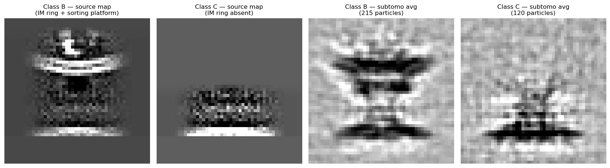

*(Central slice, dark = density. Left: source maps (class_B = full injectisome, class_C = IM ring absent).
Right: GT subtomogram averages computed from the 48³ WBP subtomograms each blind package is trying to
separate. The structural difference is at the cytoplasmic base — the IM ring / sorting platform tier.)*

**Classification mask (cylinder, red contour on global average of all 415 particles):**

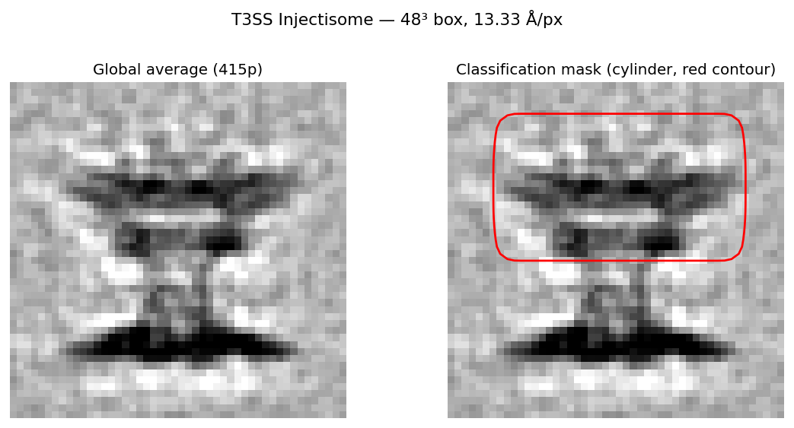

**Perfect classification reference (signal ARI = 1.0) — what a confusion entry looks like at the top of the table:**

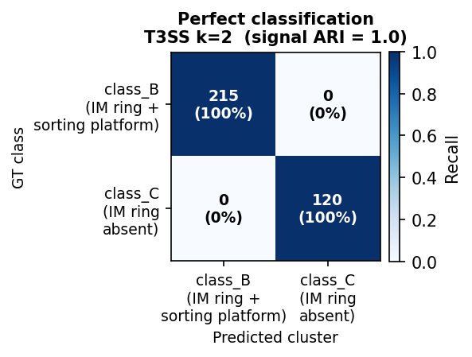

Figures show the **best-k run** per package (k=3 where it helps, k=2 otherwise). Class-avg panels = mean
of all subtomograms in that predicted cluster; GT majority label and count annotated. Confusion matrix rows
= all GT classes (class_B / class_C / junk); columns = predicted clusters. ARI is signal-only (B vs C).

| Package | Best ARI (signal) | Acc | Class Avgs (predicted clusters) | Confusion | Notes |
|---|---|---|---|---|---|
| [DISCA](disca/) | ✅ **0.812** (k=3) | 0.957 | 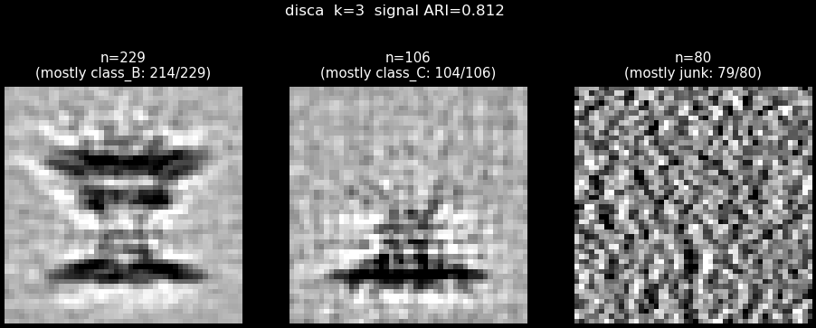 | 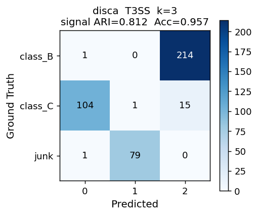 | **BEST** — CNN detects IM-ring presence/absence; immune to registration wall; 229/106/80; k=2 ARI=0.720 |
| [PEET](peet/) | ✅ **0.083** (k=3 pc1_10) | 0.455 | 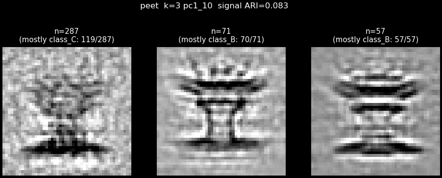 | 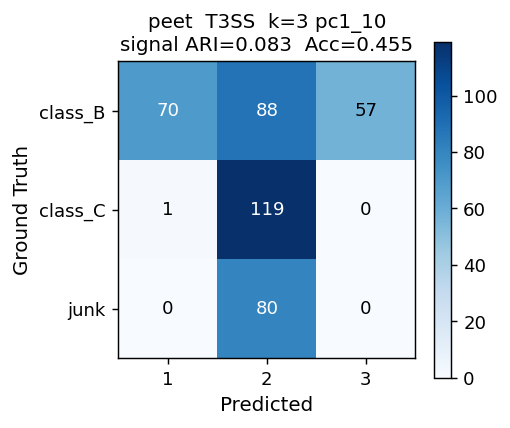 | WMD-PCA; best PCA method; marginal separation; split 287/71/57; k=2 ARI=0.069 |
| [OPUS-TOMO](opusTomo/) | ✅ **0.041** (k=3) | 0.441 | 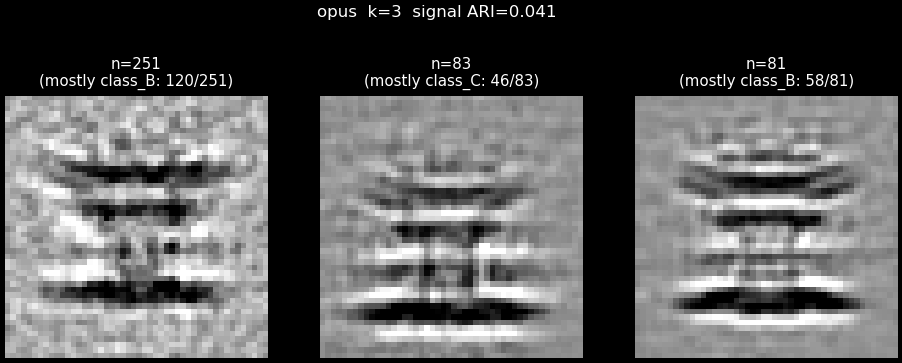 | 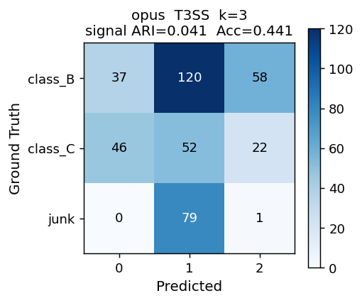 | VAE latent; k=3 slight improvement over k=2 (−0.013); split 251/83/81 |
| [STOPGAP](STOPGAP/) | ✅ **0.025** (k=3) | 0.665 | 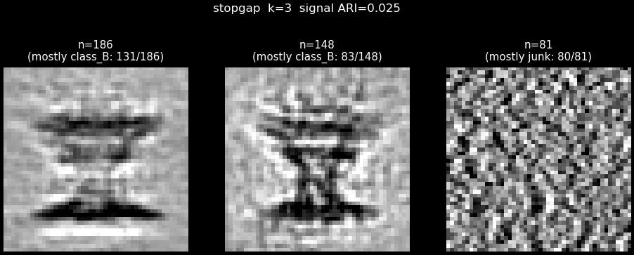 | 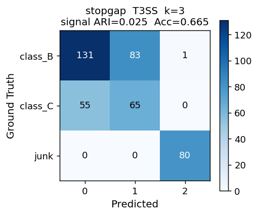 | eigenfac PCA k-means; split 186/148/81; k=2 ARI=0.020 |
| [RELION](relion/) | ✅ **0.014** (k=3) | 0.506 | 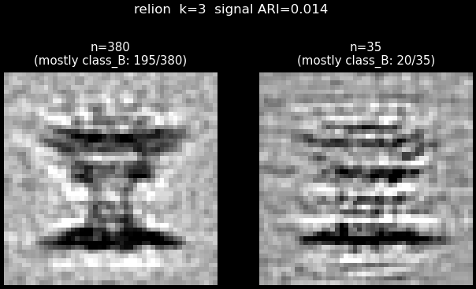 | 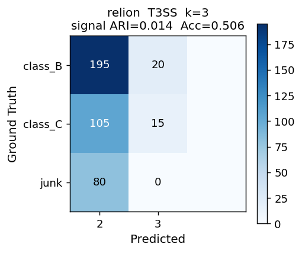 | soft-EM near-collapse; split 380/35; k=2 ARI=0.000 |
| [PyTom](PyTom/) | ✅ **0.009** (k=3) | 0.422 | 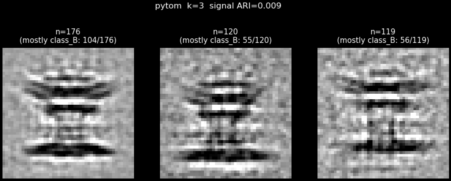 | 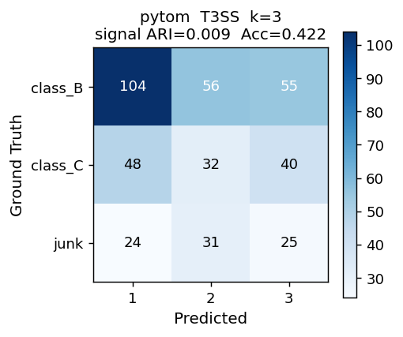 | FRM with `-a` flag + cylinder mask; split 176/120/119; k=2 ARI=0.005 |
| [Dynamo](dynamo/) | ✅ **0.000** (k=2) | 0.427 | 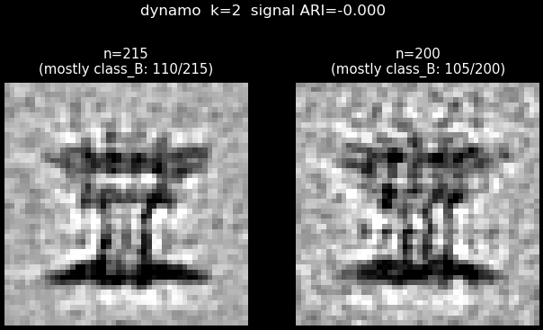 | 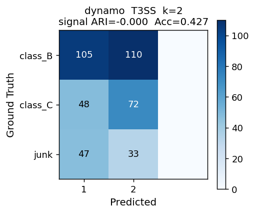 | dpkpca collapsed; unimodal PCA landscape; split 215/200 |
| [EMAN2](eman2/) | ✅ **0.000** (k=3) | — | — | — | k=3 only (junk protocol); all particles → one class; no prediction CSV |
| [TomoFlow](tomoflow/) | ✅ **0.000** (k=2) | 0.518 | 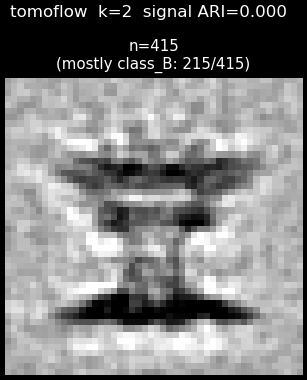 | 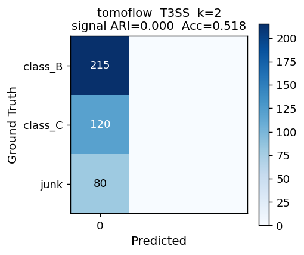 | OF features collapse at 24³ (downsample=2); all 415 → single cluster |
| [ProTomo](protomo/) | ✅ **−0.032** (k=2) | 0.405 | 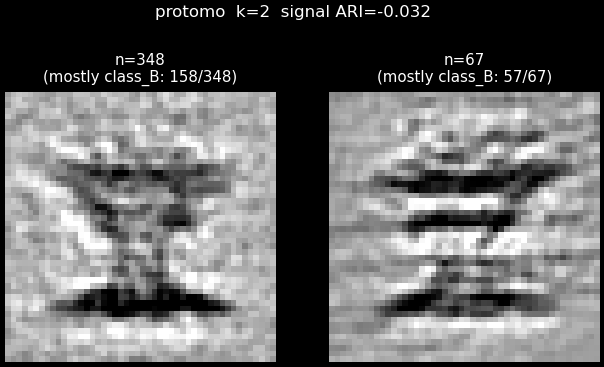 | 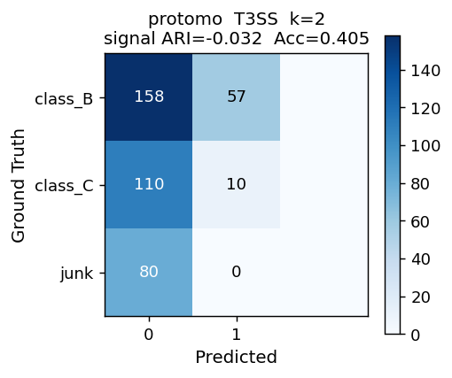 | SVD+HAC; split 348/67; k=2 only |

> **Registration wall confirmed on T3SS (9/10 packages):** GT-pose synthetic particles mis-register WBP
> reconstructions, collapsing PCA eigenspectrum. Only DISCA (CNN, no pre-registration step) escapes the
> wall — and succeeds strongly (ARI=0.812) because the IM-ring presence/absence is a gross structural
> difference detectable at 48³ resolution. This mirrors the FM_easy finding: DISCA leads on large-signal
> datasets, all PCA methods collapse on synthetic data. See `fm-easy-registration-is-the-gap.md`.
>
> **Supervised ceiling:** logistic regression on masked-PCA features → ARI ≈ 0.95 signal-only (B vs C,
> the structures differ by an entire ring tier). The signal IS learnable; only registration blocks PCA methods.
>
> **Run protocol:** GT labels at `~/Research/synthetic_sta/injectisome/subtomos/merged_BC_t3ss/labels.csv`.
> Prediction CSVs → `outputs/T3SS/<pkg>/`; mask → `~/Research/synthetic_sta/injectisome/maps/mask_t3ss.mrc`.
> Figures generated by `scripts/eval/gen_t3ss_figures.py`.

---

### T4SS (Planned)

No runs yet. See `docs/datasets.md` for planned parameters.

---

## Package Descriptions

| Package | Algorithm | Environment | Key Characteristic |
|---------|-----------|-------------|-------------------|
| **Dynamo** | HAC on PCA-reduced subtomogram distances | MATLAB | Reference result for T4P; recovers both conformational states |
| **PEET** | PCA + k-means with cylindrical masks; WMD weighting | IMOD | Best result with cyl v2 mask; built-in CCC-based junk class |
| **PyTom** | FRM-based rotational alignment + k-means with cylindrical focus mask | `pytom_env` | Requires `-a` flag and v2 mask; both critical |
| **OPUS-TOMO** | Variational autoencoder (VAE) continuous latent-space clustering | `opuset` (cu128 PyTorch) | 4 bugs patched; threshold mask required (cyl too restrictive for VAE) |
| **RELION** | Soft EM (3D maximum-likelihood classification) | `relion-5.0` | Algorithm-level failure on low-SNR T4P; FM_easy (2-class hc) **blind ARI=0.008** (GT-seeded 0.764 = supervised upper bound, not a blind score) |
| **EMAN2** | PCA split on subtomogram stack | `eman2` (Josh + Eben) | T4P k=3 canonical done; PCA captures contrast axis, not conformation |
| **DISCA** | Template-free deep unsupervised clustering (pytorch) | `disca` | Unmasked: ~94% dominant class. Masked (cyl v2): balanced 398/274 but ARI≈0 vs converging pkgs — clusters on contrast axis, agrees w/ OPUS-TOMO (0.678) |
| **TomoFlow** | ContinuousFlex optical-flow conformational classification | `tomoflow` | Unimodal landscape; CUDA texture-ref porting for sm_120 |
| **ProTomo (I3)** | Iterative alignment + multi-reference classification | native binary | Full-672 rerun complete 2026-06-09; CC=0.921 trivial (same as 234-particle run) |
| **STOPGAP** | Subtomogram averaging + PCA + k-means (MATLAB MCR) | MATLAB R2023b MCR | Owned by Eben; T4P k=2/3/4 complete (2026-06-09); does not separate two phases (ARI≈0); FM/T4SS pending |

---

## Packages Not Tested

See [docs/excluded-packages.md](../docs/excluded-packages.md) for TomoNet, emClarity, MDTOMO, HEMNMA-3D, and AC3D.

---

## How to Update This File

After any result changes:
1. Update the relevant row in the Progress Matrix above
2. Update `packages/<pkg>/README.md` results summary table

See `docs/datasets.md` for naming convention and canonical parameters.
See `CLAUDE.md` §"Package README Protocol" for the full update rule.
