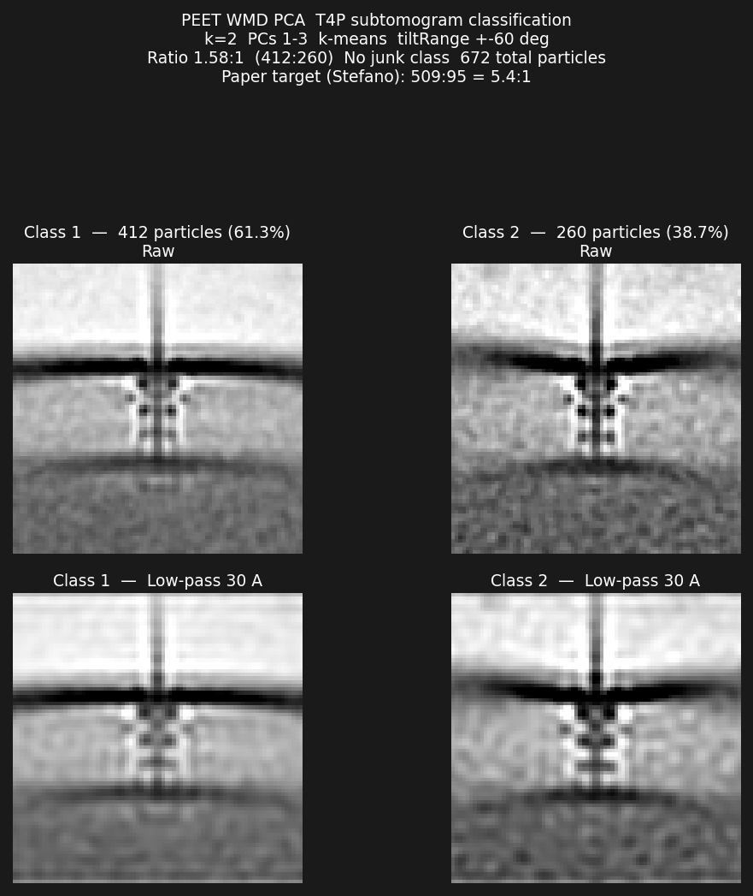
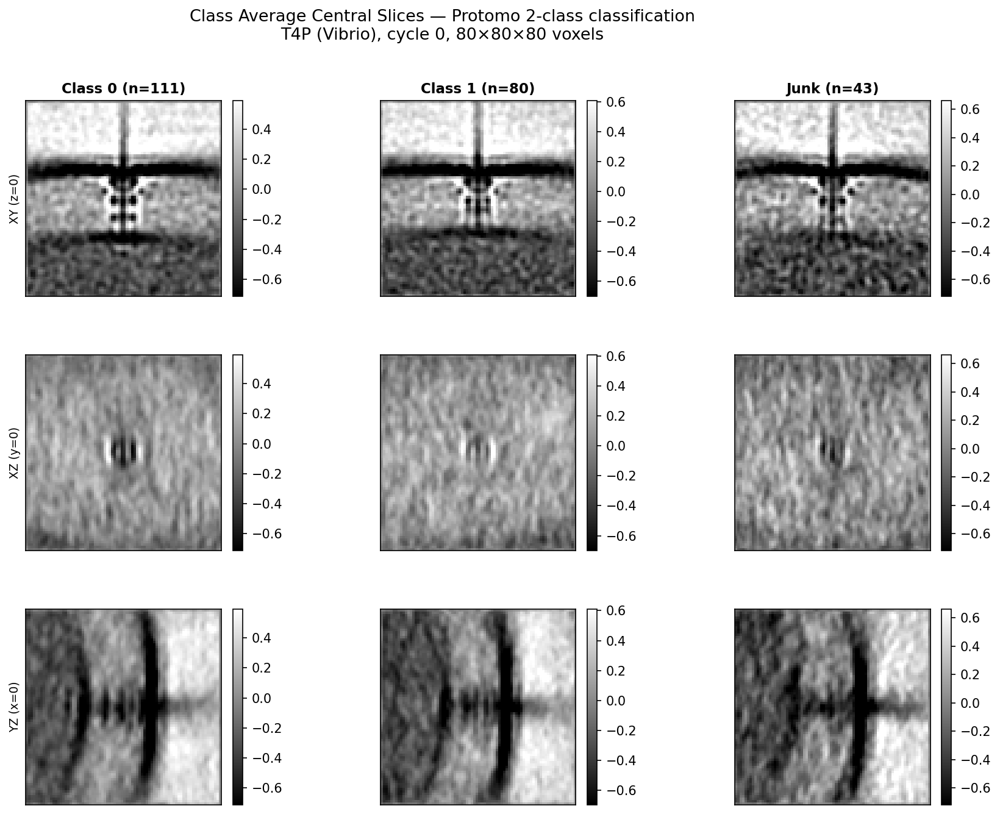
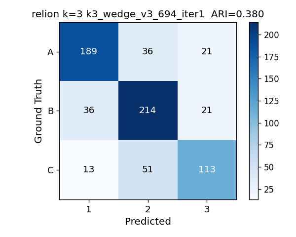
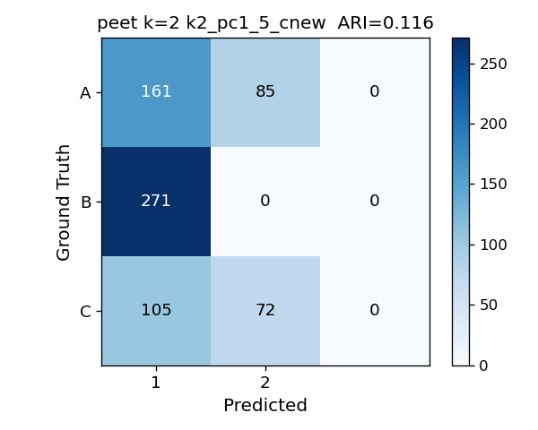
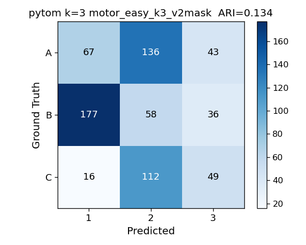

# Packages — Benchmark Progress

This directory contains all 10 actively-tested classification packages. Each package has its
own subdirectory with a `README.md` tracking current status, results, and next steps. This
file provides the master progress overview across all packages and datasets.

See [docs/excluded-packages.md](../docs/excluded-packages.md) for packages that were
evaluated but not included in the benchmark.

---

## Progress Matrix

Legend: ✅ done · 🟡 in progress · ⬜ not started · ❌ skip · — not applicable

### T4P Real Dataset (672 prealigned 80³ subtomograms, 13.33 Å/px)

**Reference (PEET v2, Stefano-validated — ring\_complete / ring\_altered / junk):**

**Cross-package particle agreement** (Dynamo · PEET · PyTom · OPUS-TOMO; row-normalized, ARI per pair):

| Package | k=2 | k=3 | k=4 | Converged? | Class Avgs (best k) | Notes |
|---------|-----|-----|-----|------------|---------------------|-------|
| [Dynamo](dynamo/) | ✅ 447/225 | — | — | **Yes** (reference result) |  | HAC; recovers both known pili phases |
| [PEET](peet/) | ✅ 374/230/68 | — | — | **Yes** |  | Cylindrical mask v2 (r=13, below-center); junk class = bottom 68 by CCC |
| [PyTom](PyTom/) | ✅ 440/232 | ✅ 422/150/100 | ⬜ | **Yes** |  | v2 cyl mask + `-a` flag; prev failure was wrong mask |
| [OPUS-TOMO](opusTomo/) | ✅ 447/225 | ✅ | ✅ | **Partial** | _(pending — run `gen_class_avg_panels.py`)_ | Threshold mask (31.2%): K=2 splits; cyl mask collapses (VAE too restrictive) |
| [RELION](relion/) | ✅ | ✅ | ✅ | **No** | — | Algorithm-level SNR failure; all 6 variants collapse to 672/0 |
| [EMAN2](eman2/) | ✅ 393/279 | ⬜ | ⬜ | **No** | _(pending — run `gen_class_avg_panels.py`)_ | Misses the two phases; k=3/4 not yet run |
| [DISCA](disca/) | ✅ | ✅ | ✅ | **No** |  | All k: ~94% dominant class + small noisy outlier |
| [TomoFlow](tomoflow/) | ✅ | ✅ | ✅ | **No** |  | Unimodal landscape; k=3 two large classes CC=0.956 |
| [ProTomo](protomo/) | ✅ | — | — | **No** |  | 2-class on 234 particles; CC=0.921; one dominant class |
| [STOPGAP](STOPGAP/) | ⬜ | ⬜ | ⬜ | — | ⬜ | Owned by Eben; full pipeline in STOPGAP/; not yet run |

### Synthetic Dataset — motor_easy (694 particles, 3 classes, 30 Å differences)

> Class C redesigned 2026-06-05 (C_noRodHook = C-ring only). Re-simulation + `merged_all_aln/`
> rebuild complete (A=246, B=271, C=177=694). All scores below use new C_noRodHook definition.

**Ground-truth class averages (A=246, B=271, C=177):** _(pending — run `gen_class_avg_panels.py` with local GT MRCs → `figures/motor_easy/reference_class_avgs.png`)_

**Perfect confusion matrix (ARI = 1.0):**

| Package | k=3 ARI | k=3 Split | Class Avgs (best k) | Best Confusion | Notes |
|---------|---------|-----------|---------------------|----------------|-------|
| [RELION](relion/) | **0.475** (iter 1) | — | _(pending)_ |  | GT-seeded firstiter_cc; collapses to ~0.16 by iter 2 |
| [PEET](peet/) | 0.050 | — | _(pending)_ |  | Best k=3; k=2 best ARI=0.116 (pc1_5) shown; WMD-PCA limitation |
| [Dynamo](dynamo/) | **0.200** (k=3) | — | _(pending)_ |  | dpkpca nc=17 sweep; class B 96-99% pure; HAC ARI≈0 |
| [OPUS-TOMO](opusTomo/) | 0.021 | 479/130/85 | _(pending)_ |  | Threshold mask (28.3%); C perfectly isolated but A/B unseparated; VAE collapses |
| [PyTom](PyTom/) | **0.134** (k=3) | — | _(pending)_ |  | v2 cyl mask; k=2 ARI=0.090; k=3 ARI=0.134 (best) |
| All others | ⬜ | — | ⬜ | ⬜ | EMAN2, DISCA, TomoFlow, ProTomo, STOPGAP not yet run on motor_easy |

---

## Package Descriptions

| Package | Algorithm | Environment | Key Characteristic |
|---------|-----------|-------------|-------------------|
| **Dynamo** | Hierarchical agglomerative clustering (HAC) on PCA-reduced subtomogram distances | MATLAB | Reference result for T4P benchmark; recovers both conformational states cleanly |
| **PEET** | PCA + k-means on aligned subtomograms with cylindrical masks; WMD weighting | IMOD (`imod` env) | Best result with cylindrical mask aligned to T4P complex axis |
| **PyTom** | FRM-based rotational alignment + k-means classification with cylindrical focus mask | `pytom_env` | Required `-a` flag (FRM module absent) and v2 cylindrical mask to converge |
| **OPUS-TOMO** | Variational autoencoder (VAE) continuous latent-space clustering | `opuset` (cu128 PyTorch) | 4 bugs patched; K=2 successful with threshold mask; cyl mask too restrictive for VAE |
| **RELION** | Soft EM (3D maximum-likelihood classification) | `relion-5.0` | Classic 3D subtomogram path retained in RELION 5; algorithm-level failure on low-SNR T4P |
| **EMAN2** | PCA split on subtomogram stack with optional wedge-fill | `eman2` | Pre-aligned identity-pose particles; wedge-fill patch applied (2026-06-05) |
| **DISCA** | Template-free deep unsupervised clustering (pytorch) | `disca` | Misses two T4P phases; good test of deep unsupervised methods |
| **TomoFlow** | ContinuousFlex optical-flow-based conformational classification | `tomoflow` | Required CUDA texture-ref porting for sm_120; landscape unimodal |
| **ProTomo (I3)** | Iterative alignment + classification on centered subtomograms | native binary | Edge-filtered to 234/672 particles; 2-class only |
| **STOPGAP** | Subtomogram averaging + PCA + k-means (MATLAB MCR) | MATLAB R2023b MCR | Owned by Eben; full source + pipeline scripts committed |

---

## Packages Not Tested

See [docs/excluded-packages.md](../docs/excluded-packages.md) for TomoNet, emClarity, MDTOMO, HEMNMA-3D, and AC3D.

---

## How to Update This File

After any STATUS.md update that touches a package result:
1. Update the relevant row in the Progress Matrix above
2. Update `packages/<pkg>/README.md` (results table + next steps)

See `CLAUDE.md` §"Package README Protocol" for the full rule.
